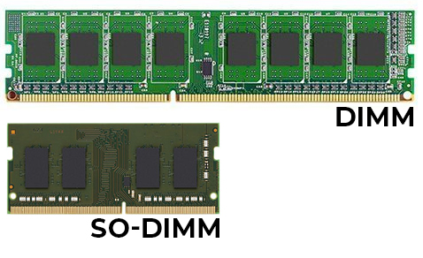

# Lezione 1 - Uso del computer

<p align="center" style="width=100%;"></p>

### Contenuti

1. [Hardware e software](#hardware-e-software)
1. [Componenti di un computer](#componenti-di-un-computer)
    - [CPU](#cpu)
    - [RAM](#ram)
    - [Dischi](#dischi)
    - [I/O](#io)
1. [Sistema operativo](#sistema-operativo)
1. [Interfaccia di Windows](#interfaccia-di-windows)
    - [Menu di avvio](#menu-di-avvio)
    - [Taskbar](#taskbar)
    - [Area di notifica](#area-di-notifica)
    - [Desktop](#desktop)
1. [File system](#file-system)
1. [Uso della tastiera](#uso-della-tastiera)
    - [Funzioni dei tasti](#funzioni-dei-tasti)
        - [Tasti di navigazione](#tasti-di-navigazione)
        - [Modificatori](#modificatori)
        - [Tastierino numerico](#tastierino-numerico)
        - [Tasti funzione](#tasti-funzione)
    - [Scorciatoie](#scorciatoie)
        - [Taglia, copia, incolla](#taglia-copia-incolla)
        - [Gestione delle finestre](#gestione-delle-finestre)
        - [Salva, salva con nome, apri](#salva-salva-con-nome-apri)
        - [Altre scorciatoie](#altre-scorciatoie)
        - [Scorciatoie avanzate](#scorciatoie-avanzate)
1. [Applicazioni fondamentali](#applicazioni-fondamentali)
    - [MS Office](#ms-office)
    - [Blocco note](#blocco-note)
    - [Browsers](#browsers)
    - [Lettori PDF](#lettori-pdf)
    - [Task manager](#task-manager)
1. [Installare software](#installare-software)
    - [Microsoft Store](#microsoft-store)
    - [Via web](#via-web)

<div style="page-break-after: always;"></div>

# Hardware e software

Il computer è una macchina elettronica capace di ricevere, trasmettere, memorizzare e soprattutto elaborare informazioni (dati).

L'hardware è l'insieme delle parti elettroniche e meccaniche che compongono fisicamente il computer.

Il software è l'insieme delle parti non materiali di un calcolatore (ad esempio un programma o un'app).

<p align="center" style="width=100%;">
    
</p>

# Componenti di un computer

Tutte le parti che stiamo per vedere sono contenute nel **case** del computer.

La **scheda madre** è la **base** su cui vengono montate tutte le altre parti.

<p align="center" style="width=100%;">
    
</p>

## CPU

Detta anche **processore**, è il **cervello** del computer: riceve i dati dalla RAM, esegue dei calcoli, e restituisce i dati alla RAM.

<p align="center" style="width=100%;">
    
</p>

Quando un computer ha un buon processore, può eseguire calcoli molto **velocemente**.


## RAM

Contiene i dati che il processore utilizza.

<p align="center" style="width=100%;">
    <br>RAM per computer fissi (sopra) e portatili (sotto)
</p>

Quando un computer ha molta RAM, allora può eseguire come operazioni **contemporaneamente**.

Quando il computer viene spento, la RAM viene **ripulita** (svuotata), e quindi se non abbiamo salvato il nostro lavoro, lo perderemo.

## Dischi

I dischi di archiviazione contengono i dati che vogliamo salvare sul nostro computer: fotografie, programmi, eccetera.

Ci sono due tipi di dischi fondamentali:
- hard disk: possono contenere molti dati, sono economici, ma sono anche lenti;
- SSD: possono contenere meno dati, sono più costose, ma sono molto più veloci.

<p align="center" style="width=100%;">
    
    
</p>

## I/O

I/O significa **input e output**:
- input: tutti i dati che noi diamo al computer; possiamo usare la tastiera, il mouse o il touchscreen;
- output: tutti i dati che il computer dà a noi; ad esempio con uno schermo o una stampante.

<div style="page-break-after: always;"></div>

# Sistema operativo

Il sistema operativo è il software che si avvia quando **accendiamo il computer** (o il telefono). Esempi di sistemi operativi:
- Windows 11
- Ubuntu Linux
- MacOS
- Android

Quando il sistema operativo è pronto, possiamo iniziare ad aprire **applicazioni** o **programmi**.

> ⚠️ Possiamo leggere le informazioni sul nostro PC aprendo il programma **Informazioni sul PC**.<p align="center" style="width=100%;">
    
</p>

# Interfaccia di Windows

L'interfaccia di un software è quello che vediamo sullo schermo quando apriamo un programma. Contiene bottoni e pulsanti, menu, campi per il testo, eccetera.

## Menu di avvio

Il menu di avvio ci permette di:
- aprire tutti i programmi del computer e trovare velocemente le funzioni che usiamo di più;
- trovare i documenti che abbiamo salvato sul computer.

<p align="center" style="width=100%;">
    
</p>

## Taskbar

Quando apriamo un programma, viene mostrato nella **barra delle applicazioni**.

<p align="center" style="width=100%;">
    
</p>

Se vogliamo, possiamo **fissare** un programma sulla barra delle applicazioni facendo clic destro sull'icona.

## Area di notifica

L'area di notifica è la parte in basso a destra e contiene informazioni sulla connessione, sul volume, sui dispotivi collegati, eccetera.

<p align="center" style="width=100%;">
    
</p>

Alcuni programmi, mentre sono aperti, mostrano un'icona nell'area di notifica.

## Desktop

Il desktop o **scrivania** è una cartella speciale, che vediamo sullo sfondo. 

Possiamo mettere sul desktop collegamenti alle applicazioni che usiamo più spesso o ai file e alle cartelle che apriamo più di frequente.

È meglio non mettere tutti i file importanti sul desktop, ma ordinarli nelle cartelle preimpostate di Windows.

<p align="center" style="width=100%;">
    <br>Un pessimo desktop
</p>

<div style="page-break-after: always;"></div>

# File system

Il file system è l'insieme dei documenti elettronici (**files**) che abbiamo salvato sul nostro disco.

È importante capire la **struttura** del file system per tenere tutti i documenti in ordine e poterli trovare facilmente.

Il file system di Windows è organizzato come nella figura:

<p align="center" style="width=100%;">
    
</p>

Ad esempio, la **posizione** o **indirizzo** del file ```Ricevuta.pdf``` è:

    C:\Utenti\Luigi\Documenti\Ricevuta.pdf

Quando salviamo un file, dobbiamo fare attenzione a **dove lo mettiamo**.

La cartella fondamentale è quella del nostro utente (detta *Home*), che contiene delle **cartelle preimpostate**:

<p align="center" style="width=100%;">
    
</p>


## Caratteristiche di un file

Un documento elettronico ha:
- un indirizzo/**posizione**, che indica il percorso della cartella che lo contiene, come ```C:\Utenti\Luigi\Documenti\```;
- un **nome** per identificarlo, come ```Ricevuta```;
- un'**estensione**/formato per capire che tipo di file è, come ```.pdf```.

Windows **nasconde le estensioni** dei file. Per visualizzarle, apriamo una cartella qualsiasi e selezioniamo ```Visualizza -> Mostra -> Estensioni nomi file ```

<div style="page-break-after: always;"></div>

# Uso della tastiera

<p align="center" style="width=100%;">
    
</p>

## Funzioni dei tasti

### Tasti di navigazione

Oltre alle frecce, possiamo usare:
- ```Canc``` per cancellare il carattere a destra (backspace al contrario);
- ```Home``` o ```↖️``` per andare all'inizio della pagina/riga;
- ```Fine``` o ```End``` per andare alla fine della pagina/riga;
- ```Pag⬆️``` per salire di una pagina;
- ```Pag⬇️``` per scendere di una pagina.

### Modificatori

I modificatori sono pulsanti che da soli non fanno nulla, ma vanno associati ad altri tasti.

I modificatori sono ```CTRL```, ```SHIFT```, ```ALT``` e ```ALT GR```. Sono presenti due tasti per ogni modificatore, per rendere più facile la combinazione.

In particolare:
- con ```SHIFT``` premuto possiamo digitare una lettera maiuscola oppure il simbolo che sta **sopra** al carattere principale;
- con ```ALT GR``` premuto possiamo digitare il simbolo che sta **a destra** di quello principale sulla tastiera;
- con ```SHIFT```+```ALT GR``` premuti possiamo digitare il simbolo che sta **in alto a destra** di quello principale (come le parentesi graffe).

Se teniamo premuto `SHIFT` e ci spostiamo con le frecce, selezioniamo il testo.

<div style="page-break-after: always;"></div>

### Tastierino numerico

Il tastierino numerico è molto utile quando dobbiamo digitare molti numeri. Viene attivato/disattivato con il tasto ```Bloc Num```.

- Se attivo permette di digitare i numeri e le operazioni di base;
- se non attivo, permette di spostarsi nel testo (frecce, eccetera).

### Tasti funzione

Hanno diverse funzioni a seconda del programma.

Spesso, associati al tasto ```Fn``` permettono di eseguire azioni particolari (alzare o abbassare il volume o la luminosità, spegnere il wifi o il bluetooth, eccetera).

## Scorciatoie

Imparare le scorciatoie da tastiera richiede un po' di tempo ma rende il nostro uso del computer molto più piacevole, comodo e veloce.

### Taglia, copia, incolla

| Scorciatoia            | Funzione                      |
|------------------------|-------------------------------|
| `CTRL`+`C`             | copia                         |
| `CTRL`+`X`             | taglia                        |
| `CTRL`+`V`             | incolla                       |
| `CTRL`+`SHIFT`+`V`     | incolla speciale              |

### Gestione delle finestre

| Scorciatoia            | Funzione                      |
|------------------------|-------------------------------|
| `ALT`+`TAB`            | cambia finestra               |
| `ALT`+`F4`             | chiudi finestra               |
| `WIN`+`D`              | mostra desktop                |

### Salva, salva con nome, apri

| Scorciatoia            | Funzione                      |
|------------------------|-------------------------------|
| `CTRL`+`S`             | salva file                    |
| `CTRL`+`SHIFT`+`S`     | salva una copia del file      |
| `CTRL`+`O`             | apri file                     |

<div style="page-break-after: always;"></div>

### Altre scorciatoie

| Scorciatoia            | Funzione                      |
|------------------------|-------------------------------|
| `CTRL`+`Z`             | annulla ultima/e azione/i     |
| `CTRL`+`Y`             | ripeti azione/i annullata/e   |
| `CTRL`+`+`, `CTRL`+`-` | zoom +/-                      |
| `CTRL`+`P`             | stampa                        |
| `CTRL`+`F`             | cerca                         |
| `CTRL`+`N`             | crea nuovo documento/finestra |
| `F1`                   | apri la guida                 |
| `F2`                   | rinomina file/cartella        |
| `CTRL`+`W`             | chiudi scheda del browser     |
| `CTRL`+`T`             | nuova scheda del browser      |
| `CTRL`+`R`             | ricarica la scheda            |

### Scorciatoie avanzate

| Scorciatoia                | Funzione                     |
|----------------------------|------------------------------|
| ```CTRL```+⬅️              | vai a sinistra di una parola |
| ```CTRL```+➡️              | vai a destra di una parola   |
| ```CTRL```+```Backspace``` | cancella parola a sinistra   |
| ```CTRL```+```Canc```      | cancella parola a destra     |
| ```CTRL```+```SHIFT```+⬅️  | seleziona parola a sinistra  |
| ```CTRL```+```SHIFT```+➡️  | seleziona parola a destra    |
| ```CTRL```+```A```         | seleziona tutto              |


<div style="page-break-after: always;"></div>

# Applicazioni fondamentali

## MS Office

È un insieme di programmi per l'**ufficio**. Serve a scrivere e modificare documenti, tenere la contabilità, eccetera.

<p align="center" style="width=100%;">
    <br>Word, programma per scrivere documenti di testo. Formato: doc, docx
</p>

<p align="center" style="width=100%;">
    <br>Excel, programma per fare calcoli. Formato: xls, xlsx
</p>

<p align="center" style="width=100%;">
    <br>PowerPoint, programma per creare presentazioni. Formato: ppt, pptx
</p>

<div style="page-break-after: always;"></div>

## Blocco note

È un **editor di testo semplice**. L'aspetto del testo non può essere modificato come in Word.

<p align="center" style="width=100%;">
    
</p>

Può aprire molti formati diversi.

## Browsers

Un browser è un programma che permette di aprire le pagine web (semplificando: andare su **internet**).

Di solito, quando apriamo un browser, vogliamo **aprire una pagina web** che già conosciamo (e che abbiamo ad esempio salvato nei preferiti) oppure fare una ricerca in un **motore di ricerca** (come Google o Bing).

<p align="center" style="width=100%;">
    <br>La pagina iniziale di Google Chrome
</p>
Esempi di browsers:
- Google Chrome
- Microsoft Edge
- Firefox
- Opera
- Safari

<p align="center" style="width=100%;">
    
</p>

## Lettori PDF

Il formato PDF è molto utile per **documenti**: quando inviamo un file in PDF, siamo sicuri che chi lo riceve lo vedrà esattamente come lo vediamo noi.

Possiamo visualizzare i PDF con Adobe Reader (complicato) o con Okular o SumatraPDF (più semplici e gratuiti).

<p align="center" style="width=100%;">
    
</p>

## Task manager

Il programma **Gestione attività** ci permette di vedere i processi in esecuzione sul computer e come il computer sta usando il suo hardware.

<p align="center" style="width=100%;">
    
    
</p>

<div style="page-break-after: always;"></div>

# Installare software

Quando vogliamo installare delle nuove applicazioni, abbiamo principalmente due metodi.

## Microsoft Store

È come lo store delle app del telefono. Possiamo installare moltissimi programmi da qui, alcuni anche open source.

<p align="center" style="width=100%;">
    
</p>

## Via web

Possiamo anche scaricare il programma da internet. In questo caso dobbiamo stare molto attenti a cosa stiamo facendo. Evitiamo di installare programmi se non ci fidiamo della fonte.

Di solito, il **sito ufficiale del programma** è la risorsa migliore. Scaricheremo un file con estensione ```.exe``` (oppure ```.msi```) che dobbiamo poi aprire per far partire l'installazione.

<p align="center" style="width=100%;">
    
</p>

> Cerchiamo di capire cosa sta succedendo durante l'installazione, senza aver fretta di fare clic su "Continua".
