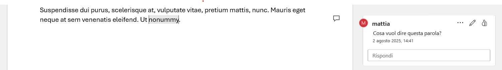

# Lezione 2 - Word

  

### Contenuti

1. [Creazione documenti](#creazione-documenti)
    - [Salvataggio](#salvataggio)
    - [Organizzazione dell'archivio](#organizzazione-dellarchivio)
    - [Salvare una copia](#salvare-una-copia)
1. [Generazione di testo casuale per gli esercizi](#generazione-di-testo-casuale-per-gli-esercizi)
    - [RAND](#rand)
    - [LOREM](#lorem)
1. [Formattazione](#formattazione)
    - [Stili](#stili)
    - [Temi](#temi)
    - [Pagina](#pagina)
        - [Margini](#margini)
        - [Righello](#righello)
        - [Colonne](#colonne)
        - [Intestazione](#intestazione)
        - [Piè di pagina](#piè-di-pagina)
        - [Bordi](#bordi)
        - [Interruzione di pagina](#interruzione-di-pagina)
1. [Inserimento elementi](#inserimento-elementi)
    - [Immagini](#immagini)
        - [Modifica immagini](#modifica-immagini)
        - [Posizionamento immagini](#posizionamento-immagini)
        - [Disposizione rispetto al testo](#disposizione-rispetto-al-testo)
        - [Didascalia](#didascalia)
    - [Tabelle](#tabelle)
    - [Commenti](#commenti)
    - [Note a piè di pagina](#note-a-piè-di-pagina)
1. [Salvataggio in cloud](#salvataggio-in-cloud)
1. [Stampa unione](#stampa-unione)
1. [Attività](#attività)
    - [Realizzazione di un dépliant aziendale](#realizzazione-di-un-dépliant-aziendale)
1. [Fonti](#fonti)

# Creazione documenti

All'avvio di Word, possiamo creare un **documento vuoto** oppure utilizzare uno dei molti modelli predefiniti (possiamo anche scaricarne altri da internet). Possiamo anche aprire un file recente.

## Salvataggio

Una volta creato il documento, al primo salvataggio ci verrà chiesto un **nome** e una **posizione** (cioè una cartella o directory) in cui salvare il documento.

> **Attenzione!** Word propone di default di salvare il file su OneDrive, cioè in cloud. Per i nostri scopi è meglio salvare i nostri file in una **cartella locale**, cioè sul nostro computer.

  

    
  

Selezioniamo anche il **formato** (cioè l'estensione che desideriamo); il default è `docx`, ma possiamo anche salvare i documenti che abbiamo creato in formato `PDF`, se vogliamo che non siano più modificabili.

Ricordiamoci di scegliere un nome sensato ma soprattutto salviamo i nostri documenti in modo ordinato, per evitare di non riuscire a ritrovarli in futuro.

## Organizzazione dell'archivio

Non salviamo tutti i documenti nella cartella di default. All'inizio del nostro lavoro, proviamo a immaginare una **struttura sensata** per le nostre cartelle. 

Ricorda che puoi creare ed eliminare cartelle, rinominarle (`F2`) e avere tutte le sottocartelle che preferisci.

Ad esempio, se stiamo archiviando dei documenti, può essere utile dividerli per anno e per mese, oppure possiamo creare una cartella per ogni paziente con `Cognome, Nome`.

> Ricorda la **struttura ad albero** del file system.

Ricorda anche di dare un **nome sensato** al tuo file, per capire immediatamente che cosa contiene senza doverlo aprire.

Nella tabella seguente, un esempio di organizzazione delle cartelle per uno studio medico.

<table style="font-size:10px;">
  <tr>
    <th>Cartella</th>
    <th>Sottocartelle</th>
    <th>Contenuto</th>
  </tr>
  <tr>
    <td>Anagrafica pazienti</td>
    <td>· Dati personali · Documenti identificativi · Referenze o segnalazioni esterne</td>
    <td>Schede pazienti, fotocopie carta d'identità, referenze da altri medici</td>
  </tr>
  <tr>
    <td>Visite/Cartella clinica</td>
    <td>· Esami diagnostici · Referti laboratoristici · Radiografie/immagini · Note visite/follow-up </td>
    <td>Referti, analisi, immagini mediche, appunti del medico, terapia prescritta </td>
  </tr>
  <tr>
    <td>Prenotazioni/Appuntamenti</td>
    <td>· Programmazione ordinaria · Cancellazioni/spostamenti · Liste di attesa</td>
    <td>Moduli o registri appuntamenti, comunicazioni con pazienti su modifiche</td>
  </tr>
  <tr>
    <td>Amministrativo</td>
    <td>· Fatture emesse · Ricevute pagate · Assicurazioni / convenzioni · Preventivi </td>
    <td>Documenti economici, conti, polizze/accordi assicurativi</td>
  </tr>
  <tr>
    <td>Risorse interne</td>
    <td>· Contratti dipendenti · Orari e turni · Comunicazioni interne · Formazione/aggiornamenti </td>
    <td>Contratti, modulistica interna, email/gruppi di lavoro, corsi frequentati </td>
  </tr>
  <tr>
    <td>Normative, privacy</td>
    <td>· Legislazione vigente · Consensi informati · Policy per la protezione dati</td>
    <td>Documenti ufficiali, moduli firme pazienti, procedure interne relative a privacy, GDPR etc. </td>
  </tr>
  <tr>
    <td>Corrispondenza</td>
    <td>· Lettere ricevute/inviate · Email stampate
    </td><td>Comunicazioni con enti esterni, altri medici, pazienti etc.</td>
  </tr>
  <tr>
    <td>Archivio </td>
    <td>· >X anni (es. 10 anni) · Pazienti non più attivi</td>
    <td>Documenti che non servono ogni giorno ma che devono essere conservati per obblighi normativi </td>
  </tr>
</table>

## Salvare una copia

Per salvare una copia del documento corrente, seleziono *File* e poi *Salva con nome*.

# Generazione di testo casuale per gli esercizi

Spesso è utile creare del testo a caso per provare le funzioni di Word. Non è molto comodo scriverlo tutto, oppure fare molti copia e incolla.

Possiamo crearlo con le funzioni `RAND` e `LOREM`.

## RAND

Se scrivo `=RAND()` in Word, genero del testo riempitivo.

Posso anche decidere quante righe deve contenere ogni paragrafo con `=RAND(numParagrafi,numRighe)`.

## LOREM

`Lorem ipsum` è l'inizio di un classico testo riempitivo usato da decenni nell'elaborazione del testo.

I comandi sono `=LOREM()` e `=LOREM(paragrafi)`.

Non possiamo decidere il numero di righe per paragrafo.

# Formattazione

I comandi per la gestione del formato del carattere sono i più noti di Word. Posso selezionare del testo e decidere il tipo di font (carattere), il colore, la dimensione, ecc.

  

> **Attenzione:** posso anche gestire agilmente le maiuscole e le minuscole di un blocco di testo con l'apposito tasto sulla barra degli strumenti.

È buona norma, in ambito lavorativo, evitare font troppo strani. I più classici sono Times New Roman, Arial e Calibri. Diverso è ovviamente il discorso per contesti più creativi.

## Stili

La modalità migliore per gestire lo stile di un testo è utilizzare gli stili, cioè **formati predefiniti** per il testo.

Gli stili permettono di impostare sia lo stile sia il “ruolo” di un certo testo. Se usiamo gli stili avremo uno stile coerente per tutto il nostro documento e potremo facilmente creare un indice.

Prova a esplorare in particolare gli stili per i titoli, sottotitoli e le citazioni.

**Gli stili possono essere modificati** per adattarsi alle nostre esigenze. Posso anche crearne di nuovi.

Quando modifico uno stile, **tutto il testo formattato con quello stile subisce le modifiche**. In questo modo non mi devo più preoccupare di modificare a mano lo stile di tutto il testo del mio documento.

Nota come ogni elemento del documento abbia uno stile, anche i punti di un elenco.

  

### Temi

I temi sono **raccolte di stili**, che posso esplorare dalla scheda *Progettazione*.

Usando stili e temi, posso prima stabilire il contenuto del mio documento, e solo in un secondo momento preoccuparmi del suo aspetto grafico.

## Pagina

Nella scheda *Layout* posso decidere le dimensioni del foglio (non sempre vogliamo usare degli A4) e il suo orientamento (verticale o orizzontale).

### Margini

Nella scheda *Layout* abbiamo diversi preset per i margini. Possiamo anche impostare dei margini personalizzati.

Dal menu completo, possiamo anche decidere se applicare l'impostazione dei margini a tutto il documento oppure soltanto ad una porzione di testo.

### Righello

Il righello è nella parte superiore della finestra che contiene il documento e modifica il rientro del testo che abbiamo selezionato.

  

I diversi simboli indicano:

- Freccia verso il basso a sinistra: rientro della prima riga
- Freccia verso l'alto a sinistra: rientro delle altre righe
- Rettangolino a sinistra: sposta i due rientri indicati sopra
- Freccia verso l'alto a destra: rientro a destra

### Colonne

Funziona in modo molto simile all'impostazione dei margini.

### Intestazione

L'intestazione è il testo che compare in alto in ogni pagina. A volte riporta il numero di pagina e altre informazioni.

Dalla scheda *Inserisci* selezioniamo *Intestazione*.

Posso selezionare alcune intestazioni predefinite, con un numero diverso di elementi. Viene creata l'intestazione e aperta la relativa scheda contestuale.

Nelle intestazioni posso inserire diverse informazioni sul documento, come la data, il titolo o il numero totale di pagine:
  
    Pagina 25 di 36

### Piè di pagina

Il piè di pagina è il testo che compare in basso in ogni pagina. Funziona in modo molto simile all'intestazione.

Anche qui posso aggiungere diversi elementi.

### Bordi

I bordi della pagina possono essere gestiti dalla scheda *Progettazione*.

### Interruzione di pagina

Dalla scheda *Inserisci* posso inserire un'interruzione di pagina. 

Le interruzioni di pagina mandano il testo successivo in una nuova pagina, indipendentemente da quanto spazio libero ci sia ancora nella pagina corrente.

Sono molto utili per **mandare in una nuova pagina i nuovi capitoli/sezioni di un testo lungo**, senza preoccuparsi di gestire manualmente il posizionamento degli elementi, come dovrei fare se mandassi a capo molte volte per cambiare pagina.

> Scorciatoia: `CTRL`+`INVIO`

# Inserimento elementi

Un documento di Word può essere arricchito con moltissimi elementi. Vediamone alcuni, principalmente dalla scheda *Inserisci*.

## Immagini

Inserendo immagini, possiamo cercare immagini online o sceglierne una che si trova sul nostro computer.

> **Nota:** per salvare immagini da una pagina web, apro la pagina, destro clic sull'immagine e *Salva immagine con nome*. Attenzione a dove salviamo il file, per poterlo selezionare poi da Word!

### Modifica immagini

Una volta inserita un'immagine, possiamo ridimensionarla, spostarla e ruotarla. Abbiamo moltissime opzioni nella scheda contestuale *Formato immagine*.

Prova ad esplorare gli stili e le opzioni per il bordo.

Molto utile la possibilità di ritagliare l'immagine (per non doverlo fare con un programma esterno).

*Layout immagine* ha funzioni molto interessanti per disporre le immagini in modo creativo.

### Posizionamento immagini

Quando vengono inserite, le immagini sono collegate al testo: se spostiamo il testo, spostiamo anche l'immagine.

Possiamo impostare questo comportamento dalle *Opzioni di layout*.

### Disposizione rispetto al testo

Possiamo impostare che il testo scorra intorno all'immagine, oppure che sia solo sotto o sopra di essa.

### Didascalia

La didascalia è il testo descrittivo sotto all'immagine. Per aggiungerne una, selezioniamo l'immagine e poi scheda *Riferimenti* e *Aggiungi didascalia*.

## Tabelle

Con *Inserisci* e poi *Tabella* posso creare una tabella delle dimensioni (righe e colonne) di cui ho bisogno. Una volta creata, posso gestirla come su Excel, aggiungendo colonne, righe e modificando la formattazione delle celle.

  

Per aprire il menu dell'intera tabella, mi posiziono con il mouse nell'angolo in alto a sinistra della tabella.

Prova a esplorare la scheda contestuale per le opzioni formattazione della tabella. Esistono anche degli stili preimpostati nella tabella.

## Commenti

I commenti possono essere inseriti in ogni punto del documento e sono molto utili per idee e appunti oppure quando si sta lavorando ad un **documento condiviso**.

Si aggiungono posizionando il cursore nel punto del testo che vogliamo commentare e selezionando *Inserisci* e poi *Commento*.

  

## Note a piè di pagina

Sono note che si trovano in fondo alla pagina, indicate con dei numeri ad apice.

Si possono aggiungere dalla scheda *Riferimenti* dell'interfaccia di Word.

# Salvataggio in cloud

Finora abbiamo salvato i nostri file in **locale**, cioè sul nostro computer.

Possiamo anche salvare il file *in cloud* ovvero sui server di Microsoft. Il servizio di archiviazione in cloud di Microsoft si chiama **OneDrive**.

Questo ci permetterà di accedere al file da qualsiasi dispositivo connesso a internet. Per poterlo fare dobbiamo disporre di un **account Microsoft**.

Dalla scheda *File* selezioniamo *Salva con nome* e poi *OneDrive*. Valgono le stesse osservazioni sul nome del file e sulla sua posizione (teniamo in ordine!).

  

# Stampa unione

La stampa unione permette di creare documenti (ad esempio lettere, email o etichette) che poi devono essere distribuiti in **grandi quantità** (ad esempio a tutti i clienti). Invece di creare questi documenti a mano, scrivendo ogni volta un nome diverso, creeremo un modello e indicheremo a Word da dove "recuperare" i dati da inserire nel nostro modello.

Quindi, avremo bisogno di:
- un **documento principale**, con una parte fissa e dei campi da riempire
- un'**origine dei dati** con cui riempire i campi, organizzata in tabelle.

L'intestazione delle tabelle del file di origine dei dati deve corrispondere ai nomi dei campi da riempire.

  

1. Definiamo il documento che vogliamo riprodurre. Scheda `Lettere` di Word, `Inizia stampa unione -> Creazione guidata stampa unione`. Selezioniamo `Lettere`.

1. Indichiamo il documento di partenza. Un modello chiaro e semplice è quello denominato `Lettera intramontabile`.

1. Indichiamo il documento che contiene i destinatari (che possono ad esempio provenire dai nostri contatti di Outlook o da un file Excel). Possiamo crearne uno molto facilmente utilizzando il file `Dati di esempio` fornito insieme al corso.

    In questo contesto possiamo anche filtrare i dati di partenza in base a certi parametri. La funzione di filtro è molto utile quando il documento di origine è molto grande.

1. Proseguiamo con la procedura guidata, molto intuitiva.

1. Se vogliamo aggiungere qualche campo, selezioniamo `Inserisci un campo unione` e scegliamo il campo che vogliamo inserire.

1. Selezioniamo `Anteprima risultati` possiamo vedere le lettere che stiamo andando a creare. Le possiamo scorrere con le frecce al di sopra di `Trova destinatario`.

1. Cliccando su `Finalizza` possiamo stampare (e quindi anche esportare in PDF) i documenti che ho creato.

> Se salvo in PDF, mi viene creato un unico file con tutti i documenti uniti insieme.

# Attività

## Realizzazione di un dépliant aziendale

  

Immagina di lavorare nell'ufficio marketing di un'azienda e di dover realizzare un dépliant informativo da distribuire ai clienti. Utilizza **Microsoft Word** per creare un documento in formato pieghevole (2 o 3 ante). Puoi seguire anche un esempio ([DOCX](./word-depliant.docx) o [PDF](./word-depliant.pdf)).

**Istruzioni passo-passo**

1. **Impostazione pagina**
   - Apri un nuovo documento e imposta il layout in **orizzontale**.
   - Suddividi la pagina in **tre colonne** (per simulare un pieghevole a tre ante).

1. **Grafica e struttura**
   - Inserisci il **logo aziendale** (puoi utilizzare un'immagine a scelta).
   - Aggiungi **colori aziendali** o uno schema cromatico coerente.
   - Definisci titoli e sottotitoli per le varie sezioni (es. *Chi siamo*, *Servizi offerti*, *Contatti*).

1. **Contenuti testuali**
   - Scrivi una breve presentazione dell'azienda.
   - Elenca i servizi/prodotti principali in forma schematica (elenchi puntati o numerati).
   - Inserisci i contatti (indirizzo, telefono, email, sito web).

1. **Elementi grafici aggiuntivi**
   - Inserisci almeno **due immagini** rappresentative (es. foto di prodotti, uffici, persone).
   - Usa **forme** o **SmartArt** per evidenziare informazioni importanti.

1. **Finalizzazione**
   - Controlla l'allineamento e l'impaginazione per simulare il pieghevole stampato.
   - Salva il documento sia in formato **.docx** sia in **.pdf**.

# Fonti
- [Corso Word di CodeGrind (YouTube)](https://www.youtube.com/playlist?list=PLP5MAKLy8lP8VEocrKnhCcp2FzOirE7jx)
- [Corso completo di Word (.zip)](./corso-word.zip)

**Extra**

- [Corso completo di PowerPoint (.zip)](./corso-powerpoint.zip)