# Lezioni 3, 4 e 5 - Excel

  

### Contenuti
1. [Inserimento dati](#inserimento-dati)
    - [Copia/incolla/incolla speciale/trasponi](#copiaincollaincolla-specialetrasponi)
    - [Formattazione celle](#formattazione-celle)
    - [Formato dati](#formato-dati)
1. [Formule base](#formule-base)
    - [Operazioni aritmetiche](#operazioni-aritmetiche)
    - [Somma](#somma)
    - [Media](#media)
    - [Calcolo percentuali](#calcolo-percentuali)
    - [Calcolo IVA](#calcolo-iva)
1. [Filtrare e ordinare i dati](#filtrare-e-ordinare-i-dati)
1. [Inserimento di grafici](#inserimento-di-grafici)
1. [Salvataggio e condivisione](#salvataggio-e-condivisione)
1. [Attività](#attività)
    - [Esercizi](#esercizi)
    - [Realizzazione di una fattura](#realizzazione-di-una-fattura)
1. [Fonti](#fonti)

# Inserimento dati

Il punto di partenza fondamentale di Excel sono le *celle*, che contengono *dati*.

Quando ho riempito una cella, per confermare l'inserimento di un dato, premo `INVIO`. Excel passa allora alla cella successiva.

Dopo avere inserito dei dati in una cella, con `CTRL`+`INVIO` posso confermare senza passare alla cella successiva.

Se riempio una cella ma non voglio confermare, premo `ESC` e la cella ritorna vuota.

`ALT+INVIO` mi permette di andare a capo all'interno di una stessa cella.

Posso confermare un suggerimento di riempimento con `TAB`.

Posso selezionare celle non contigue tenendo premuto `CTRL` e cliccando sulle celle.

Se faccio "capire" a Excel che sto iniziando una sequenza (inserendo almeno due dati), come:	

- `1 2` (salto 1)
- `1 5` (salto 4)
- `lun mar`
- `gennaio febbraio`

e trascino, Excel mi prosegue la sequenza. Questa funzione è detta **riempimento automatico** o autofill.

## Copia/incolla/incolla speciale/trasponi

Inseriamo dei valori a caso in alcune celle. Proviamo a trascinare un valore per copiarlo con **autofill**, cioè il riempimento automatico. 

> Quando autofill è disponibile, **il cursore cambia forma**.

Funzionano i classici `CTRL`+`C`, `CTRL`+`X`, `CTRL`+`V`, fondamentali per l'intero sistema operativo.

Molto interessanti sono le opzioni per incollare, che è possibile visualizzare dal click destro oppure dal menu *Incolla* in alto a sinistra.
- prova a copiare solo la formattazione (come con "Copia formato");
- prova a copiare solo il valore interno, ma non la formattazione;

Posso anche incollare dei dati trasponendoli, sempre dal menu di "Incolla". Trasporre una riga/colonna significa trasformarla in una colonna/riga.

    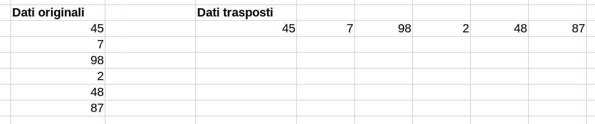

## Formattazione celle

La formattazione celle è il modo in cui le celle appaiono, cioè il loro **aspetto grafico**: colore, font, grassetto/corsivo, colore di sfondo, allineamento, eccetera.

Le opzioni di formattazione sono molto simili a quelle di Word.

Per una formattazione piacevole e rapida, sono disponibili diversi stili per le celle, come in Word.

## Formato dati

Il formato dei dati, da non confondere con la formattazione delle celle, indica il **tipo di dato** che una cella contiene: testo, importi economici, percentuali, date, numeri con un certo numero di decimali, eccetera.

Uno stesso numero, in base al suo formato, può essere mostrato in modo diverso:

    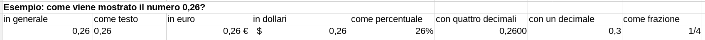

Nota che in Excel il testo viene allineato di default a sinistra, mentre i numeri a destra.

# Formule base

Il vero potere di Excel è quello di *fare calcoli* sui dati che inseriamo nelle celle.

Per eseguire calcoli dobbiamo usare delle **formule**. Una formula si inizia scrivendo un `=` nella cella. 

## Operazioni aritmetiche

Possiamo usare le quattro operazioni fondamentali,
ovvero `+`, `-`, `*`, `/`.

    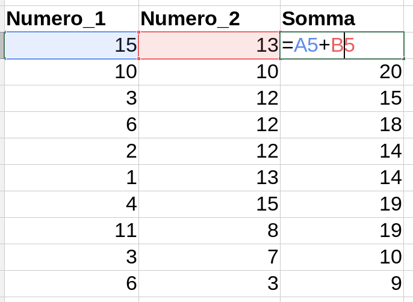

Possiamo anche scrivere le parentesi tonde con la 
normale notazione matematica.

Se una cella è stata riempita con una formula/funzione, al variare dei valori delle celle utilizzate nel calcolo, cambierà automaticamente il contenuto della cella.

Se faccio un copia/incolla di una formula in un gruppo di dati, Excel cambia automaticamente i riferimenti delle celle in modo che la formula risulti corretta per la riga/colonna su cui ci troviamo.

Funziona anche con il trascinamento/autofill.

## Somma

Per la somma, la sintassi è `=SOMMA(num1;num2;num3)`.

Per indicare un gruppo di celle, in modo da scrivere rapidamente le funzioni, usiamo sintassi `A1:A7`, ovvero "tutte le celle da A1 ad A7". Un gruppo di celle viene chiamato "range".

Il range funziona anche in orizzontale e in diagonale e può anche essere selezionato con il mouse.

    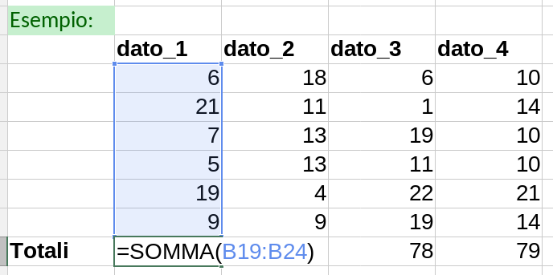

Un range può essere trattato come addendo della funzione `SOMMA`, permettendo di sommare più di un range.

## Media

La funzione `MEDIA` calcola la media aritmetica di un gruppo di celle.
			
La sintassi è `=MEDIA(arg1;arg2;...)`. Per i range, uso invece `=MEDIA(range)`.

    

Con le funzioni `SOMMA` e `MEDIA` è molto comodo usare la funzione di riempimento automatico.

## Calcolo percentuali

Se voglio calcolare il `19%` di *qualcosa*, devo fare
`qualcosa * 0,19`.

Ad esempio: se voglio calcolare il prezzo finale dopo uno sconto, dovrò poi fare una sottrazione tra il prezzo iniziale e la percentuale che ho calcolato.

- prezzo iniziale: `134,78 €`
- sconto percentuale: `19%`, ovvero `0,19`
- sconto in euro: `prezzo iniziale * 0,19 = 134,78 * 0,19 = 25,61 €`
- prezzo finale: `prezzo iniziale - sconto in euro = 134,78 - 25,61 = 109,17 €`

In alternativa, posso calcolare a mente che ciò che voglio ottenere è il `(100-19)% = 81%` del prezzo iniziale, e quindi calcolare direttamente `134,78 * 0,81 = 109,17 €`.

Analogamente, se voglio calcolare il `134%` di *qualcosa*, devo fare `qualcosa * 1,34`.

Su Excel esiste anche il **formato percentuale**, che tratta le percentuali come visto sopra. Ad esempio, se scrivo `0,68` e imposto il formato percentuale, mi verrà mostrato `68%`.

> Ricorda, il simbolo di percentuale ti sta dicendo di dividere il numero che vedi per 100.

## Calcolo IVA

Terminologia di base:

| Termine           | Significato                             |
|-------------------|-----------------------------------------|
| IVA               | Imposta sul valore aggiunto             |
| Aliquota          | Percentuale dell'IVA da applicare       |
| Prezzo netto      | Prezzo prima dell'applicazione dell'IVA |
| Prezzo lordo      | Prezzo dopo l'applicazione dell'IVA     |
| Scorporo dell'IVA | Scomposizione del lordo in netto+IVA  |

Se il **prezzo netto** di un prodotto è `129,00 €` con l'aliquota al `22%`, per avere il **lordo** dovrò calcolare il `122%` di `129,00`, quindi `129,00 * 1,22 = 150,06 €`.

# Filtrare e ordinare i dati

Immaginiamo di avere una tabella come la seguente:

    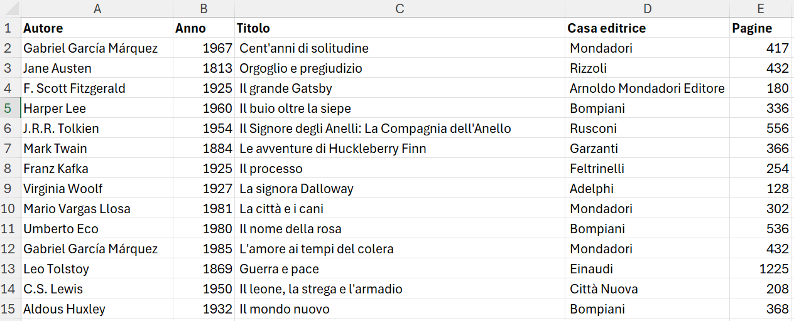

Molto importante creare l'intestazione della tabella		
e avere una **formattazione impeccabile** (no righe vuote, no formati diversi).

Selezioniamo tutta la tabella, intestazioni comprese, e poi scheda *Dati* e *Filtro*. Abbiamo anche un pulsante nella scheda *Home*.

Adesso possiamo filtrare e ordinare i nostri dati cliccando sul triangolino presente nell'intestazione.

    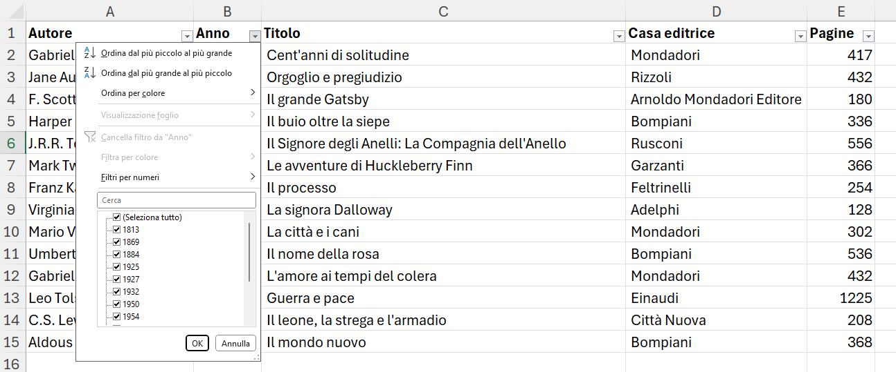

Prova a esplorare le opzioni di filtraggio e ordinamento.

# Inserimento di grafici

Creiamo una tabella come la seguente:

    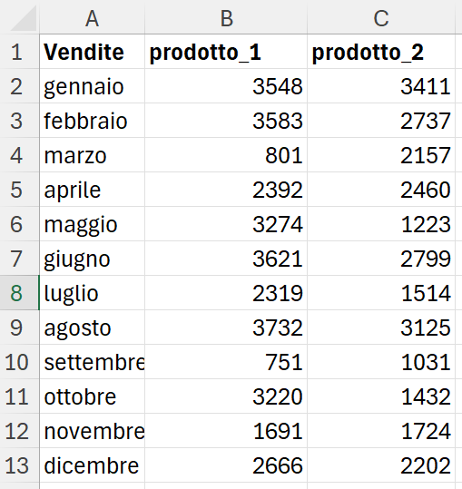

Seleziono ora la mia serie di dati (intestazioni comprese) e seleziono *Inserisci* → *Grafico*.

Possiamo scegliere diversi tipi di grafico, in base ai dati che vogliamo rappresentare (nell'immagine è mostrato un grafico a colonne).

    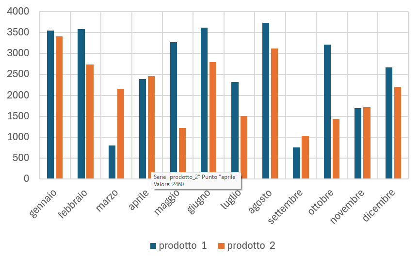

# Salvataggio e condivisione

Le opzioni di salvataggio e condivisione del file sono del tutto analoghe a quelle di Word.

# Attività

## Esercizi

**Esercizi con le formule**:

1. Crea una tabella come la seguente:
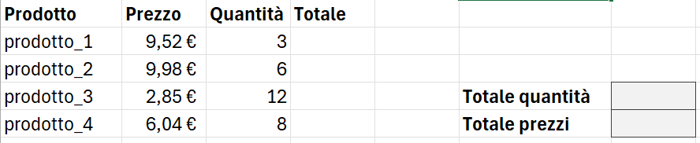
Inserisci una formula per calcolare il totale moltiplicando il prezzo per la quantità. Calcola infine in due nuove celle il totale delle quantità e il totale dei prezzi.

2. Crea una tabella come la seguente. Il prezzo di un macchinario viene pagato in un certo numero di mesi.
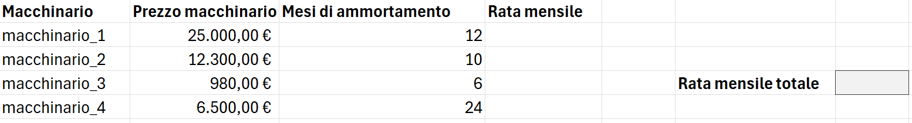
Inserisci le formule per calcolare la rata mensile di ogni macchinario. Inserisci una formula per calcolare il totale delle rate mensili.

3. Crea una tabella come la seguente, impostando le formule per calcolare il valore del prezzo finale.
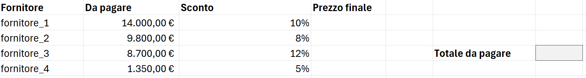

4. Crea una tabella come la seguente, impostando le formule per calcolare il valore del prezzo finale.
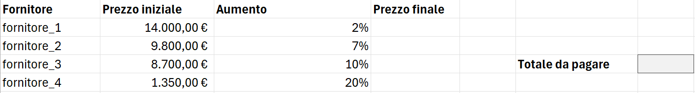

5. Crea una tabella come la seguente, impostando le formule per calcolare il prezzo per ogni partecipante alle cene.
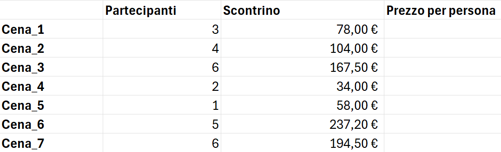

6. Crea un bilancio casalingo sulla base della seguente tabella. Imposta le formule per calcolare i dati richiesti.
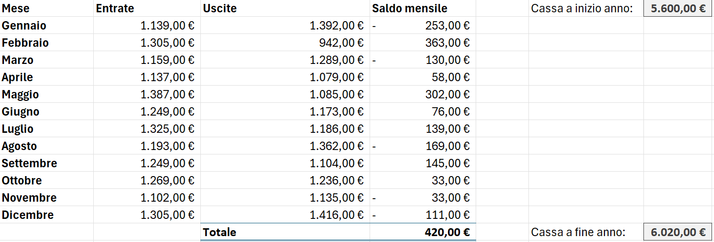
Il saldo mensile può essere positivo o negativo, a seconda che le entrate siano maggiori delle uscite oppure viceversa.

7. 
Un libero professionista ha bisogno di aiuto nel gestire le entrate della sua partita IVA in regime forfettario. Crea un foglio Excel che gli permetta di inserire i pagamenti ricevuti e calcolare poi tasse, netto, eccetera. <b>Funzionamento della partita IVA in regime forfettario:</b><ul><li> Reddito = quanti soldi mi danno i miei clienti<li>Imponibile = una percentuale del reddito, la parte su cui vengono calcolate le tasse, viene calcolato in base a vari fattori.<li>Coefficiente di redditività = percentuale del reddito con cui calcolare l'imponibile, dipende dal tipo di attività svolta.<li>Le tasse da pagare per questo regime sono due:<ol><li>imposta sostitutiva, pari al 15% dell'imponibile<li>contributi previdenziali, pari al 26,07% dell'imponibile</ol><li>Il netto guadagnato dal professionista è il reddito meno le tasse.<li>Ipotizza un foglio di calcolo per un libero professionista, calcolando l'imponibile, l'ammontare totale delle tasse e infine il netto ricevuto dal professionista. Calcola poi il reddito mensile.<li>Utilizza un coefficiente di redditività a tua scelta compreso tra 67% e 78%.</ul>

**Esercizi con le funzioni**

1. Costruisci una tabella simile a questa e calcola il numero totale di pezzi:

    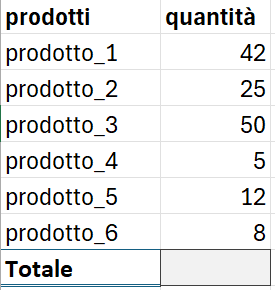

2. Costruisci uno scontrino simile al seguente e calcola il totale:

    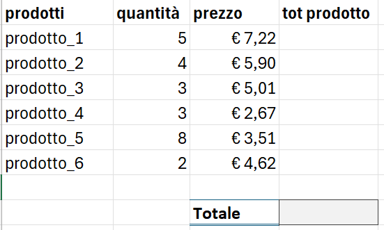

3. Crea una tabella con i dati di vendita mensili per 4 venditori, sul periodo di un anno. Calcola poi il totale delle vendite per ogni venditore.

4. Utilizzando la tabella dell'esercizio precedente, calcola la media delle vendite di ogni venditore.

5. Utilizzando la tabella dell'esercizio precedente, calcola la media delle vendite di tutti i venditori, mese per mese.

6. Crea una tabella simile alla seguente e calcola il totale dei prodotti e la giacenza media per ogni negozio.

    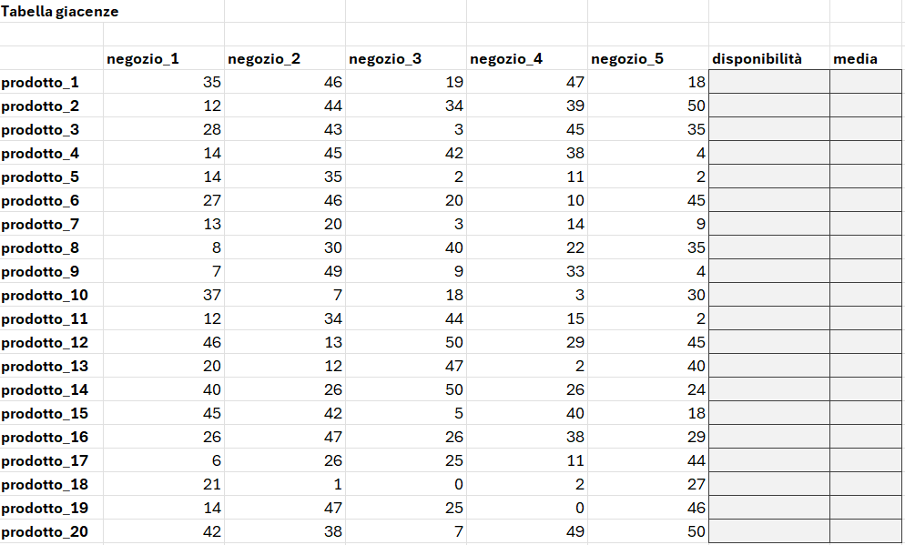

## Realizzazione di una fattura

  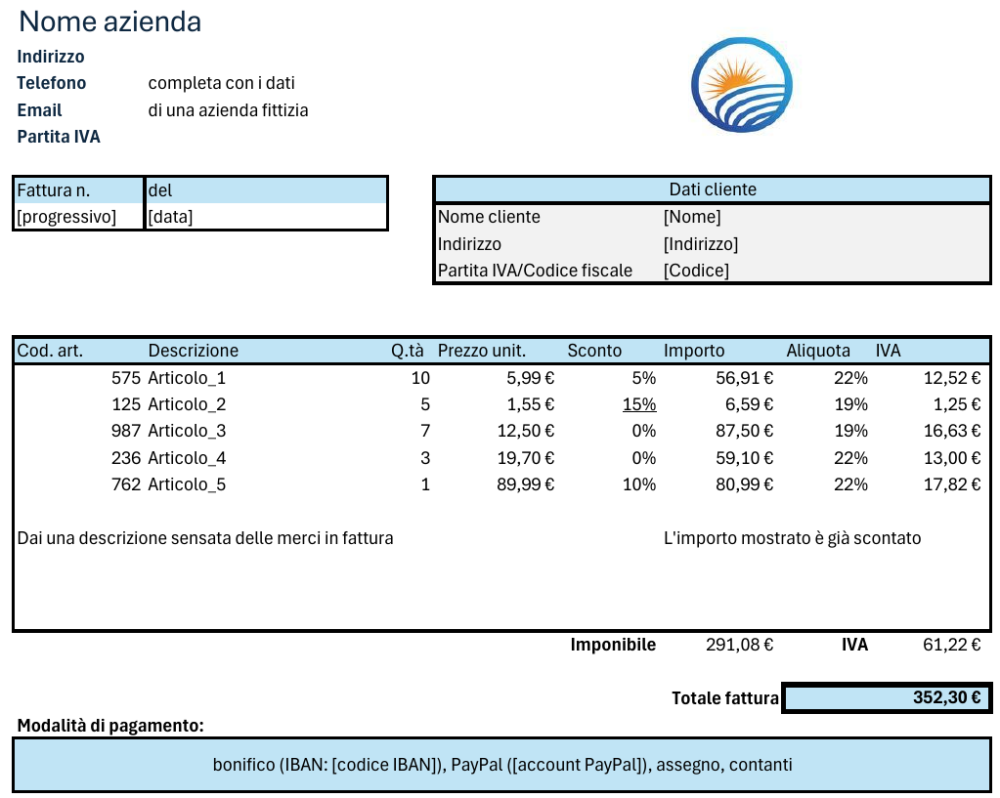

Realizza una fattura per un'azienda immaginaria. Come riferimento puoi usare un modello [XLSX](./modello-fattura.xlsx) o [PDF](./modello-fattura.pdf).

**Istruzioni passo-passo**

1. **Intestazione**
   - Apri un nuovo documento.
   - Inserisci i dati dell'azienda.
   - Inserisci un **logo** a tua scelta a destra dei dati dell'azienda.
   - Inserisci i dati della fattura (attenzione al formato data).
   - Inserisci i dati del cliente a destra dei dati della fattura.

1. **Beni/servizi**
    - Imposta la tabella con la descrizione delle merci:
        - codice dell'articolo;
        - descrizione dell'articolo;
        - quantità;
        - [opzionale] sconto percentuale applicato;
        - prezzo tot articolo (già scontato);
        - aliquota applicata (in formato percentuale);
        - IVA calcolata sul prezzo già scontato.
    - Inserisci dei dati fittizi relativi all'acquisto di almeno quattro articoli, creando **per la prima riga** le formule per il calcolo automatico di di prezzo totale scontato e IVA.
    - Usa **Autofill** per riempire le altre celle relative agli articoli in fattura.

1. **Totali**
    - Calcola l'imponibile totale come somma di tutti i prezzi (scontati) degli articoli.
    - Calcola l'IVA totale.
    - Calcola il totale della fattura come somma dei due dati precedenti.

1. **Note finali**
    - Inserisci le informazioni relative alle modalità e alla data di pagamento.

# Fonti
- [Corso Excel di CodeGrind (YouTube)](https://www.youtube.com/playlist?list=PLP5MAKLy8lP-lC4pGt64iXehuinJX5ZYu)
- [Corso completo di Excel (.zip)](./corso-excel.zip)