# Lezioni 6 e 7 - Posta elettronica

<p align="center" style="width=100%;">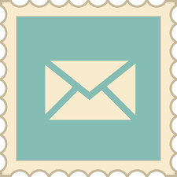</p>

### Contenuti

1. [Posta elettronica](#posta-elettronica)
    - [Allegati](#allegati)
    - [Destinatari](#destinatari)
        - [a, cc, ccn](#a-cc-ccn)
        - [Risposte](#risposte)
    - [Regole d'oro per le email](#regole-doro-per-le-email)
1. [Webmail](#webmail)
    - [Cartelle](#cartelle)
    - [Etichette](#etichette)
    - [Filtri](#filtri)
    - [Calendar](#calendar)
        - [Creazione di un evento](#creazione-di-un-evento)
        - [Modifica di un evento](#modifica-di-un-evento)
        - [Più calendari](#più-calendari)
        - [Creazione di un calendario](#creazione-di-un-calendario)
        - [Condivisione di un calendario](#condivisione-di-un-calendario)
        - [Eventi ricorrenti](#eventi-ricorrenti)
    - [Contacts](#contacts)
        - [Creazione e modifica contatto](#creazione-e-modifica-contatto)
        - [Esportare e importare contatti](#esportare-e-importare-contatti)
1. [MS Outlook](#ms-outlook)
    - [Creazione email](#creazione-email)
    - [Calendario](#calendario)
        - [Inviti a riunioni](#inviti-a-riunioni)
        - [Promemoria](#promemoria)
    - [Contatti](#contatti)
        - [Importare ed esportare contatti](#importare-ed-esportare-contatti)
        - [Gruppi](#gruppi)
1. [Sicurezza](#sicurezza)
    - [PEC](#pec)
    - [Spam](#spam)
    - [Phishing](#phishing)

<div style="page-break-after: always;"></div>

# Posta elettronica

La posta elettronica (email) è la modalità di comunicazione più importante offerta da internet.

Un indirizzo email è costituito da un nome utente ```mariorossi.06```, dal simbolo ```@``` (si legge "at" in inglese) e da un dominio (```gmail.com```).

Ogni email possiede un oggetto (l'argomento del messaggio), un testo/contenuto ed eventualmente uno o più allegati.

Per utilizzare la posta elettronica dobbiamo avere un **account**, ad esempio un account Google.

Sul computer, possiamo gestire la nostra email:
- da un browser (ad esempio Chrome); parliamo allora di **webmail** (come Gmail);
- da un programma apposito (come Microsoft Outlook), detto **client di posta**.

Nello stesso modo, sul telefono possiamo aprire la nostra mail da un browser oppure da un'app dedicata.

## Allegati

Allegare un file ad una mail significa inviare, oltre ad un messaggio di testo, anche uno (o più) file dal nostro computer, come immagini, documenti di Word o file PDF.

Possiamo farlo dall'icona con una graffetta nella barra degli strumenti del nostro client di posta.

<p align="center" style="width=100%;">
    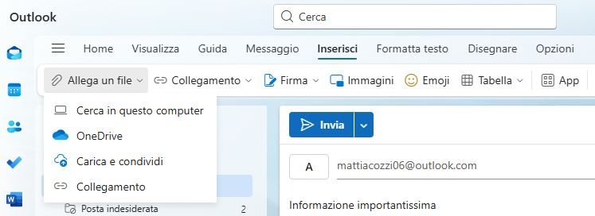<br>Allegati in Outlook
</p>

> È bene non allegare alle email file troppo grandi: per tale necessità sono meglio altri strumenti online.

## Destinatari

### a, cc, ccn

Esistono tre categorie di destinatari per un messaggio email:
- **A**, per uno o più destinatari principali;
- **Cc** (copia per conoscenza), per destinatari secondari;
- **Ccn** (copia conoscenza nascosta), per destinatari che però non possono sapere a quali altri indirizzi (in Cc) la mail è stata inviata.

<p align="center" style="width=100%;">
    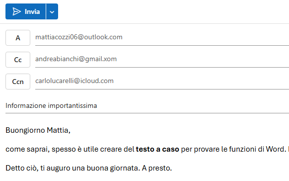
</p>

Nel caso volessimo inserire più di un indirizzo in questi campi, separiamo le diverse email con una virgola.

### Risposte

Come abbiamo visto, possiamo ricevere email inviate anche ad altre persone.

In base alle esigenze, possiamo voler rispondere a tutti i destinatari oppure solo al mittente originario.

Abbiamo diverse opzioni:
- **Rispondi** per scrivere solo al mittente originario;
- **Rispondi a tutti** per inviare una mail a tutti i destinatari dell'elenco;
- **Inoltra** per "girare" la mail a qualche altro contatto.

<p align="center" style="width=100%;">
    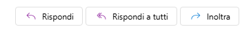
</p>

<div style="page-break-after: always;"></div>

## Regole d'oro per le email

- **Usa un indirizzo e-mail formale.** I recapiti di posta elettronica creati da piccoli sono senz'altro simpatici, ma per dare l’immediata impressione di serietà è meglio usare un indirizzo adatto a un ambiente lavorativo. Nulla di troppo pomposo, basta servirsi del proprio nome e cognome, seguito, in caso di omonimia, dalla data di nascita: es. *ugo.rossi@email.it*.
- **L’oggetto è importante.** Chi legge la vostra email non ha tempo da perdere. Deve capire subito, leggendo l’oggetto, di cosa si parlerà e deve sentirsi invogliato ad aprirla. Pensate a qualcosa breve, ma d’effetto. Ad esempio, *OGGETTO: info programma evento "X"*.
- **Ad ogni contesto il suo saluto.** Se state scrivendo ad un potenziale datore di lavoro, a un’azienda o ad un professore, esordire con "Ciao" o "Caro" non è la scelta migliore. Più adatti sono, invece, "Egregio" o "Gentile" seguiti da titolo e cognome del destinatario: es. \emph{Egregio Prof. Rossi}. Se non conoscete il nome, optate per un generico "All’attenzione del responsabile ufficio/settore\ldots".
- **Chi sei?** Se state scrivendo a una persona per la prima volta, è importante presentarsi subito. Dopo il saluto utilizzate le prima riga per presentarvi. Questo aiuterà chi riceve la riceve a orientarsi meglio nella lettura. Es. *Sono Anna Russo, responsabile del Reparto Grafica*.
- **Arriva dritto al punto.** Evitate giri di parole e andate dritti al punto, parlando della questione che nell’oggetto avete già accennato, senza essere ripetitivi. Es. *Le scrivo per chiedere informazioni sul programma dell’evento*.
- **Ringrazia sempre.** Prima di salutare, è bene ringraziare il destinatario e fargli sapere se ci si aspetta una risposta. "Grazie dell’attenzione" e "In attesa di notizie, le auguro buona giornata" denotano cortesia e professionalità.
- **Ricorda i saluti.** Come nei saluti iniziali, anche per quelli finali bisogna tener presente chi sarà il destinatario. "Cordiali saluti" oppure "Distinti saluti" sono il giusto compromesso. Non dimenticate di firmarvi con nome e cognome.

<div style="page-break-after: always;"></div>

# Webmail

## Cartelle

Gmail organizza automaticamente le nostre email in diverse **categorie**:

<p align="center" style="width=100%;">
    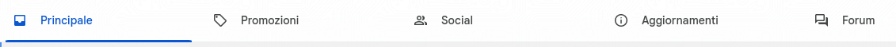
</p>

Se crediamo che una mail sia nella categoria sbagliata, la possiamo trascinare dove vogliamo. Gmail "imparerà" dalle nostre scelte.

## Etichette

Le etichette in Gmail funzionano come "cartelle" ma con una differenza: **una stessa email può avere più etichette**. Servono per organizzare meglio la posta.

Per creare un'etichetta, apriamo Gmail, scorriamo in basso a sinistra e clicchiamo su ```Altro -> Crea nuova etichetta```.

Per applicare l'etichetta ad una mail, selezioniamo la mail e facciamo clic sul simbolo dell'etichetta.

Per modificare le etichette (nome, colore, eccetera) usiamo la barra di sinistra.

## Filtri

I filtri sono regole che permettono di eseguire alcune azioni automatiche sulle mail ricevute che rispettano certi criteri (provengono da un certo indirizzo, hanno una certa parola nel testo, eccetera).

Le azioni automatiche che possono essere eseguite sono ad esempio:
- applicare una o più etichette;
- archiviare o eliminare direttamente;
- segnare come importante;
- inoltrare ad un altro indirizzo di posta.

Per creare un filtro, facciamo clic sulla barra di ricerca in alto e iniziamo a scrivere un criterio di ricerca (come l'indirizzo del mittente, l'oggetto, parole contenute nel testo).

Facciamo clic sulla freccia a destra della barra di ricerca e impostiamo le condizioni. Clicchiamo infine su "Crea filtro".

> Se vogliamo filtrare tutti i messaggi provenienti da uno stesso dominio, possiamo usare il filtro ```*@dominio.it```. L'asterisco indica qualsiasi carattere.

Quando creiamo un filtro possiamo scegliere tra varie azioni:  
- Salta Posta in arrivo (Archivia);
- Applica un’etichetta;
- Elimina;
- Inoltra a un altro indirizzo;
- Contrassegna come importante;
- Segna come già letto;
- Sposta in una categoria (come Promozioni, Aggiornamenti, eccetera).

## Calendar

Google Calendar è l'agenda elettronica della suite Google.

Permette di:
- gestire i propri appuntamenti;
- gestire gli appuntamenti di un gruppo di persone;
- programmare eventi ricorrenti;
- programmare videochiamate;
- creare eventi a cui invitare partecipanti esterni.

<p align="center" style="width=100%;">
    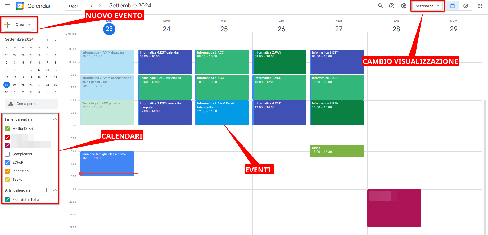<br>È possibile cambiare la porzione di tempo visualizzata. Attenzione alle scorciatoie!
</p>

### Creazione di un evento

<p align="center" style="width=100%;">
    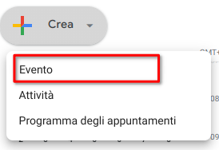
</p>

Apriamo la finestra rapida di creazione evento. Questa finestra contiene alcune opzioni per la creazione di un nuovo evento, ma non tutte.

<p align="center" style="width=100%;">
    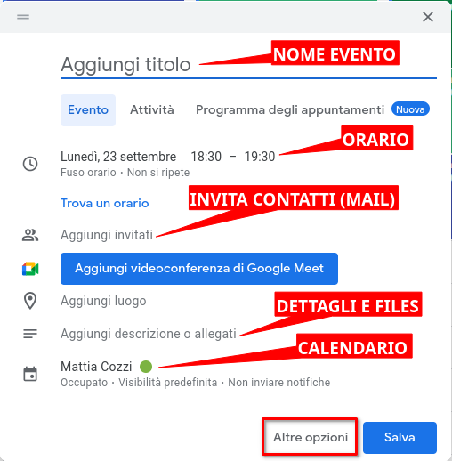
</p>

Scrivendo degli indirizzi email nello spazio per gli invitati, si condivide l'evento che stiamo creando con qualcuno.

Gli invitati ricevono una mail di invito, da cui possono decidere se accettare o meno. Se accettano, vedranno l'evento nel proprio calendario.

Quando si invita qualcuno, Calendar aggiunge automaticamente l'opzione per una videochiamata tramite Google Meet.

Molto utile la descrizione dell'evento, che può essere usata per:
- appunti;
- ordini del giorno di una riunione;
- file utili (posso allegare ricette mediche ad un appuntamento col dottore);
- commenti degli utenti coinvolti nell'evento.

<p align="center" style="width=100%;">
    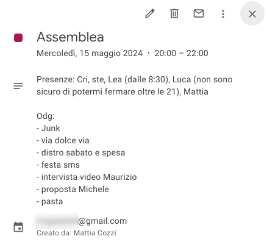
</p>

### Modifica di un evento
Una volta creato un evento, possiamo cambiarne il colore o eliminarlo facendo destro clic sull'evento.

Trascinando i bordi di un evento possiamo inoltre modificarne la durata; trascinando l'evento posso spostarlo nel tempo.

### Più calendari
Google Calendar può gestire diversi calendari contemporaneamente. Organizzare il proprio lavoro con diversi calendari è utile per:
- separare diverse attività: lavoro, studio, tempo libero;
- gestire il calendario di più dipendenti/collaboratori;
- condividere eventi con amici e parenti.

<p align="center" style="width=100%;">
    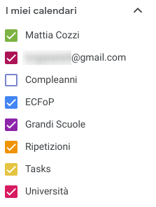
</p>

### Creazione di un calendario

<p align="center" style="width=100%;">
    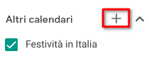
</p>

Per creare un nuovo calendario, clicchiamo sul ```+``` vicino ad "Altri calendari".

<p align="center" style="width=100%;">
    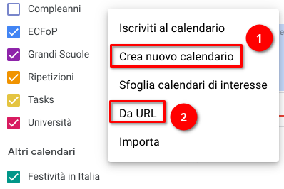
</p>

L'opzione ```Da URL``` permette di iscriversi ad un calendario a cui siamo stati invitati tramite link (URL è sinonimo di link).

Una volta creato un calendario, possiamo modificarne le proprietà cliccando sui tre puntini a fianco al nuovo calendario nell'interfaccia principale.

### Condivisione di un calendario

Dalla finestra delle opzioni calendario selezioniamo "Aggiungi persone e gruppi".

<p align="center" style="width=100%;">
    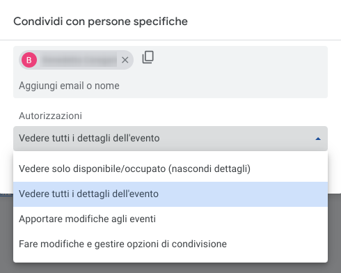<br>Un invitato può avere permessi (cioè "poteri") diversi.
</p>

Gli invitati ricevono una mail, da cui possono decidere se accettare l'invito. Se sì, vedranno il nuovo calendario insieme ai loro.

### Eventi ricorrenti
Spesso un evento si ripete nel tempo, come ad esempio:
- un orario scolastico;
- un cliente ricorrente;
- un'attività ripetitiva;
- un corso di qualche tipo.

Calendar contiene utilissime funzioni per gestire gli eventi ricorrenti.

Possiamo impostare la ripetizione di un evento dalla pagina (anche rapida) di modifica evento

<p align="center" style="width=100%;">
    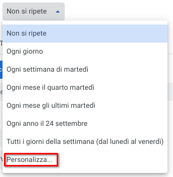
</p>

Le opzioni più interessanti si trovano su "Personalizza".

## Contacts

Google ci mette a disposizione una rubrica elettronica chiamata Google Contacts.

<p align="center" style="width=100%;">
    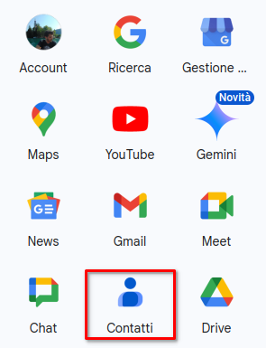
</p>

<p align="center" style="width=100%;">
    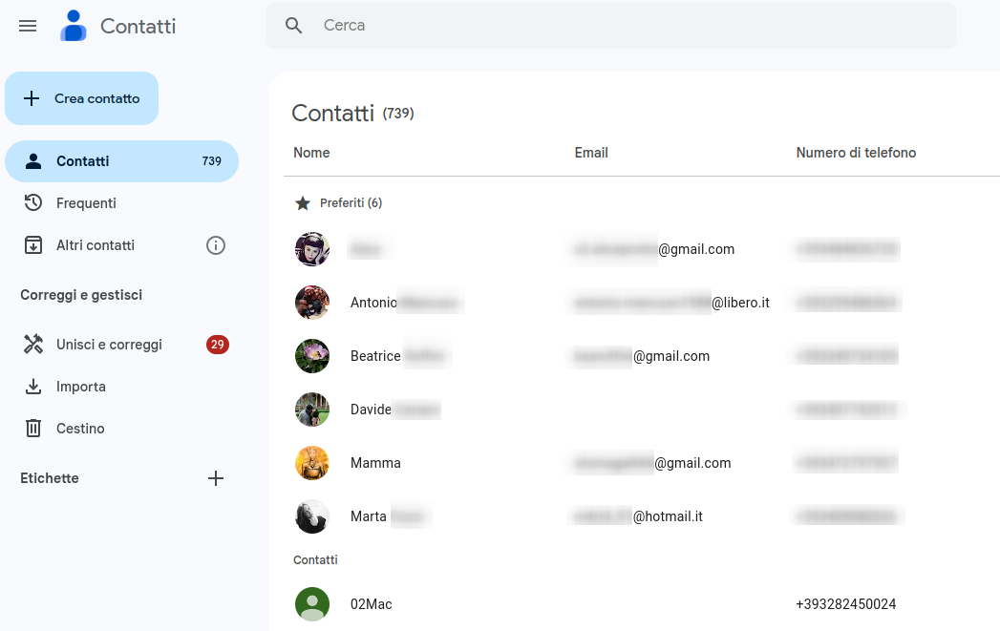
</p>

Possiamo aggiungere facilmente un contatto da Gmail passando con il mouse sopra all'indirizzo che vogliamo aggiungere alla nostra rubrica.

<p align="center" style="width=100%;">
    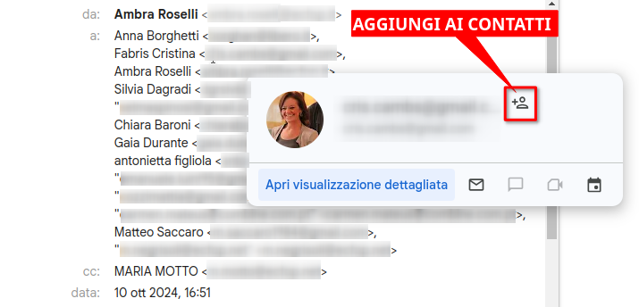
</p>

### Creazione e modifica contatto

Dalla schermata principale, clicchiamo su ``Crea contatto'' e scegliamo di crearne uno solo.
  
Possiamo aggiungere molte informazioni, molto utile se stiamo creando una **rubrica lavorativa**.


Per modificare un contatto, usiamo l'icona della matita dall'elenco principale.

<p align="center" style="width=100%;">
    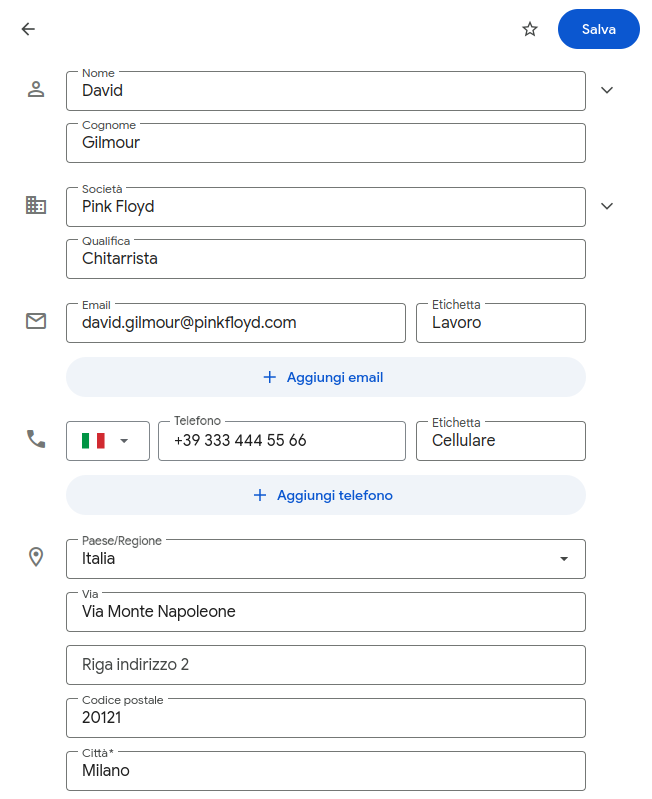
</p>

Cercando i contatti nella nostra rubrica li possiamo anche etichettare.

### Esportare e importare contatti

Selezionando un gruppo di contatti (o un'etichetta), dal menu con i tre puntini possiamo esportare i dati, cioè **scaricare un file** che contiene tutti i contatti selezionati, con i dettagli in un ordine ben preciso.

Il formato più semplice è CSV Outlook, che possiamo aprire con Excel.

<p align="center" style="width=100%;">
    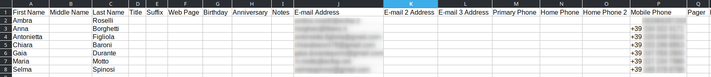
</p>

Molto utile se dobbiamo inviare molti contatti a qualcuno o per fare un backup.
 
Importare è l'opposto di esportare: possiamo caricare velocemente un gran numero di contatti mediante un **file sul nostro computer**.

Partiamo da un file CSV Outlook, come quello precedente, e clicchiamo su "Importa" dalla schermata principale.

<div style="page-break-after: always;"></div>

# MS Outlook

Microsoft Outlook è il programma del pacchetto Office per gestire **email, contatti e calendario**.

Non è importante il tipo di email (Outlook, iCloud, Gmail, eccetera), che abbiamo, perché Outlook supporta tutti questi tipi di account, sia privati sia aziendali.

> Se non si riesce ad accedere al proprio account, è possibile **crearne uno**.

## Creazione email

Per inviare un nuovo messaggio email, apriamo Outlook e selezioniamo *Nuovo messaggio* in alto a sinistra.

<p align="center" style="width=100%;">
    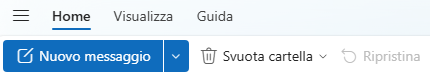
</p>

Ricordiamo, oltre ovviamente ai destinatari, di inserire un **oggetto** (cioè l'argomento della mail) che sia facile, chiaro e breve.

Il testo della mail può essere formattato in modo molto simile a Word.

<p align="center" style="width=100%;">
    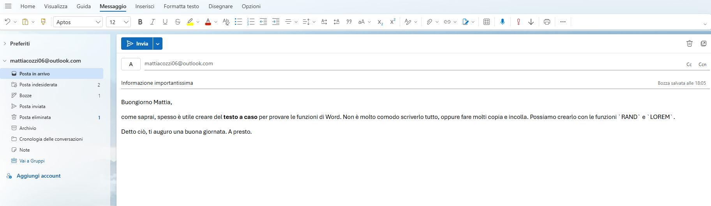
</p>

È bene non esagerare con la formattazione.

Una funzione molto interessante e utile è la **pianificazione dell'invio della mail** ad una data e un orario prestabiliti.


## Calendario

Outlook contiene anche un calendario per organizzare le nostre attività. Può essere visualizzato cliccando sull'icona apposita nella barra di sinistra.

<p align="center" style="width=100%;">
    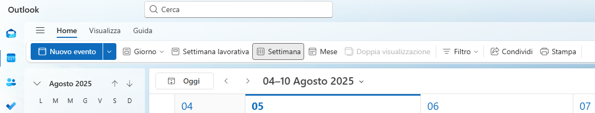
</p>

Per creare un evento abbiamo l'apposito bottone, oppure usiamo la funzione di trascinamento nell'interfaccia principale.

Prova ad esplorare le opzioni di creazione di un evento (ad esempio rendendo un evento ricorrente o della durata di un'intera giornata).

Una delle comodità di un calendario elettronico è inoltre la **condivisione** di informazioni (eventi, riunioni, eccetera) con altri utenti.

### Inviti a riunioni

Nella finestra di creazione dell'evento, possiamo **invitare** altri partecipanti all'evento. Se gli invitati accettano l'invito, vedranno il mio evento nel loro calendario di Outlook.

Notiamo che quando digitiamo l'indirizzo di un contatto, il bottone blu da "Salva" passa a "Invia". Gli invitati ricevono infatti una mail che li invita a confermare la loro partecipazione all'evento.

Quando invitiamo altri partecipanti, viene creata automaticamente una riunione online con Microsoft Teams.

### Promemoria

Possiamo impostare un promemoria per l'evento, indicando quanto tempo prima vogliamo che venga inviata una notifica che ci ricorda l'evento.

<p align="center" style="width=100%;">
    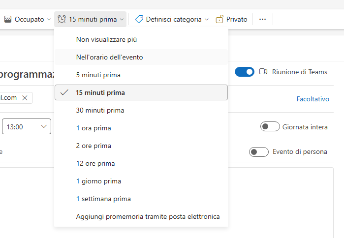
</p>

## Contatti

A sinistra, sotto l'icona del calendario, troviamo l'icona per gestire i nostri contatti, cioè la rubrica.

Possiamo creare un nuovo contatto da qui (maggiore è il numero di informazioni, meglio è) oppure facendo clic sull'indirizzo di posta all'interno di una qualsiasi mail.

<p align="center" style="width=100%;">
    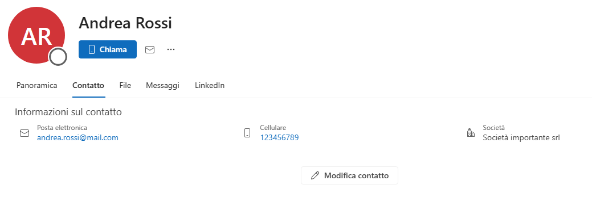
</p>

Per modificare un contatto, usiamo l'apposito bottone.

### Importare ed esportare contatti

Se selezioniamo *Gestisci contatti* possiamo esportare i nostri contatti in un **file CSV**, che possiamo poi inviare ad altre persone oppure usarlo per spostare tutti i nostri contatti su un altro computer.

Una volta esportati i contatti, puoi provare a capire come funziona un file CSV aprendo il file scaricato con il blocco note.

Analogamente, se disponiamo di un file CSV che contiene dei contatti, possiamo importarlo in Outlook.

Un esempio classico di utilizzo è la spostamento di contatti da Outlook a Gmail e viceversa.

### Gruppi

Quando i contatti sono molti, è bene tenerli organizzati. Un modo per farlo è aggiungere i contatti ad una o più **categorie**. cioè gruppi di contatti.

Possiamo ad esempio creare categorie per tutti i contatti di un certo ufficio, di una certa azienda, oppure ancora di tutte le persone coinvolte in un certo progetto.

Un'altra modalità di organizzazione dei contatti sono gli **elenchi**, che ci permettono anche di inviare rapidamente una mail a tutti i contatti dell'elenco.

<p align="center" style="width=100%;">
    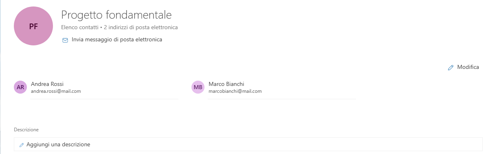
</p>

<div style="page-break-after: always;"></div>

# Sicurezza

## PEC

La Posta Elettronica Certificata è un sistema di comunicazione simile all'email, con alcune caratteristiche di sicurezza e certificazione che rendono i messaggi "garantiti".

Un documento inviato via PEC ha lo stesso valore legale di una raccomandata, come definito nel DPR 11 febbraio 2005 n. 68.

Ogni impresa deve possedere un indirizzo PEC univoco iscritto nel Registro delle imprese, pena l'esclusione da detto Registro.

La certificazione della PEC viene effettuata da appositi enti inclusi nell'**Elenco Pubblico dei Gestori accreditati**, ad esempio Aruba.

<p align="center" style="width=100%;">
    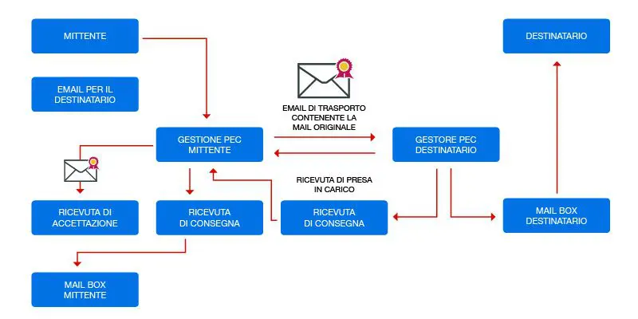<br>Il meccanismo di funzionamento della PEC
</p>

> Attenzione! Gmail non è una PEC!


## Spam 
Con la parola "spam" si indica l’invio di messaggi di posta elettronica indesiderati, di email sgradite, o non richieste, generalmente spedite con fini promozionali e commerciali da utenti spesso sconosciuti. Sinonimo è "junk mail", cioè "posta spazzatura".

Oggi lo spam viene veicolato attraverso diversi canali: posta elettronica, ma anche chat, social network e altri servizi online.

Se le mail indesiderate sono inviate da organizzazioni legali, è sempre presente in fondo alle mail un link per disiscriversi.

<p align="center" style="width=100%;">
    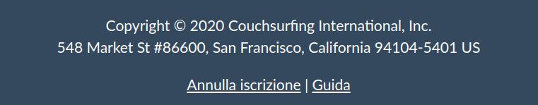
</p>


## Phishing

Il phishing è una forma di spam che punta a indurre l'utente a rivelare informazioni personali o riservate.
  
Si realizza inviando agli utenti mail molto somiglianti a vere mail da parte di organizzazioni o aziende (banche, poste, servizi di consegna pacchi, ecc.).

In queste mail l'utente viene invitato a fornire la sua password o altri dati, eventualmente anche con link a siti fasulli.

Alcune di queste mail vengono automaticamente filtrate dai server, ma è sempre bene controllare la veridicità di una mail (controllando ad esempio l'indirizzo da cui proviene).

<p align="center" style="width=100%;">
    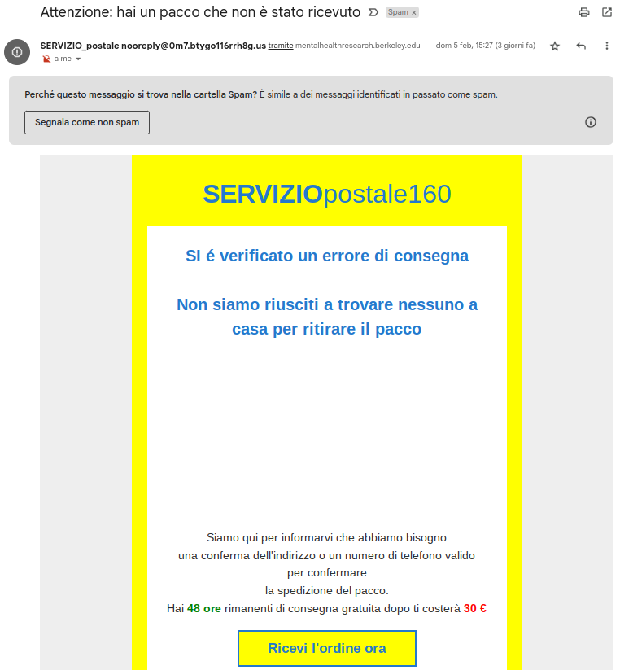
</p>