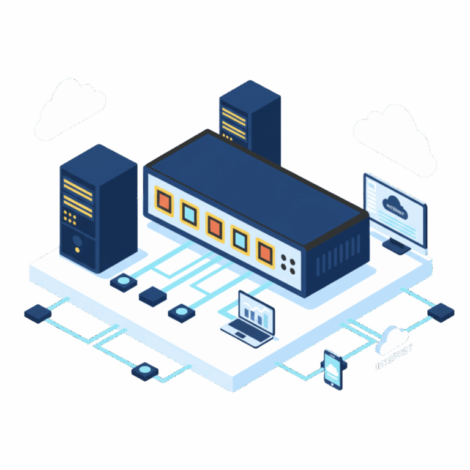
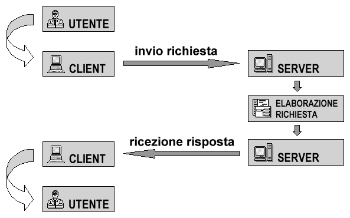
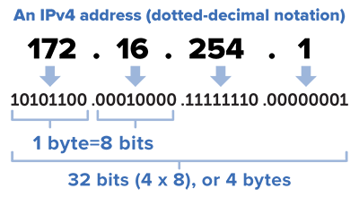
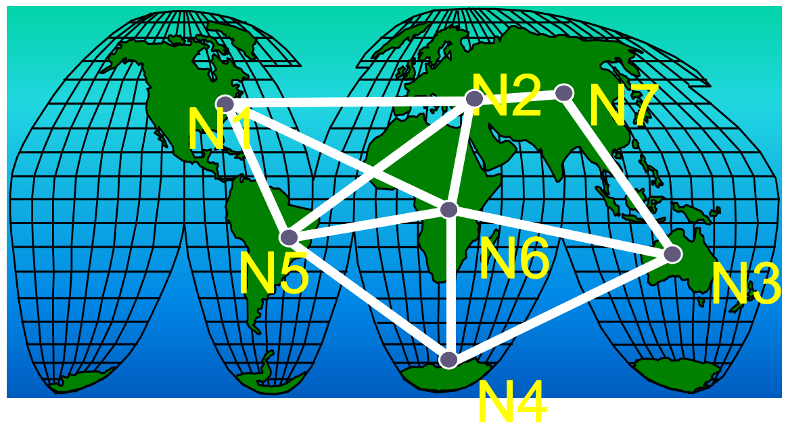

# Lezione 8 - Networking

### Contenuti

1. [Introduzione alle reti](#introduzione-alle-reti)
    - [Dimensione delle reti](#dimensione-delle-reti)
    - [Modello client/server e peer to peer](#modello-clientserver-e-peer-to-peer)
    - [Rete aziendale](#rete-aziendale)
    - [VPN](#vpn)
    - [IP](#ip)
1. [Internet](#internet)
    - [Storia](#storia)
    - [Il web](#il-web)
    - [Il browser](#il-browser)
    - [Netiquette](#netiquette)
1. [Dati](#dati)
    - [Hosting](#hosting)
    - [Cosa sono i miei dati?](#cosa-sono-i-miei-dati)
    - [Cloud computing](#cloud-computing)
1. [Sicurezza](#sicurezza)
    - [Crittografia](#crittografia)
    - [Autenticazione](#autenticazione)
    - [Antivirus](#antivirus)
    - [Hacking](#hacking)
    - [Firewall](#firewall)
    - [Cookies](#cookies)
    - [Privacy](#privacy)
        - [Garante della privacy](#garante-della-privacy)
        - [D.lgs n.196/2003](#dlgs-n1962003)

# Introduzione alle reti
I computer vengono collegati tra loro per:
- comunicare tra loro;
- condividere risorse: 
    - hardware (stampanti);
    - files (su dischi fissi condivisi);
    - programmi o interi sistemi operativi;

Il collegamento avviene tramite un componente hardware chiamato **scheda di rete**.

## Dimensione delle reti
Possiamo classificare le reti in base alla loro **dimensione**:
- Reti locali:
    - **(W)LAN** ((Wireless) Local Area Network), terminali connessi nello stesso luogo (casa, ufficio);
    - **MAN** (Metropolitan Area Network), terminali in un'area urbana o comuni limitrofi;
- Reti geografiche:
    - **WAN** (Wide Area Network), terminali in un'intera nazione;
    - **GAN** (Global Area Network), terminali in tutti i continenti.

Ogni terminale è identificato da un numero, l'indirizzo MAC (Media Access Control), univoco. Esempio:

    00-08-74-4C-7F-1D

## Modello client/server e peer to peer

Dividiamo le reti in due classi:
- **client/server:** alcuni computer (server o host) mettono a disposizione risorse, altri (client) le utilizzano;
- **peer to peer:** tutti i computer condividono le loro risorse e tutti possono utilizzarle.

    

## Rete aziendale
Una rete aziendale è una rete che serve a condividere le risorse informatiche di un'azienda (files e documenti, ma anche stampanti e altro).

È necessaria la presenza di uno **switch**, un dispositivo che permette di smistare il traffico di dati sui vari terminali.

Per collegare la rete aziendale all'esterno (come alla rete internet) è necessario un **router**. I dati sono protetti da un **firewall**.

## VPN
Spesso le aziende (e ultimamente anche i privati) utilizzano una VPN (Virtual Private Network).

La VPN permette di inviare dati in maniera criptata (e quindi sicura) ad un server esterno, che si interfaccia poi con la rete internet.

## IP
Gli standard per la comunicazione tra computer sono detti **protocolli**.
Il protocollo universalmente usato per le reti è il protocollo TCP-IP. L’acronimo significa **Transfer Control Protocol/Internet Protocol**.

L'indirizzo IP è composto da **4 cifre da 0 a 255 separate da punti** e serve a identificare in modo univoco un dispositivo in rete.

    

# Internet

## Storia

- **1969** Il progetto ARPANET, finanziato dal Dipartimento della Difesa statunitense è la prima rete mai costruita, ottenuta collegando quattro nodi. Le applicazioni eseguite erano principalmente programmi di File Transfer Protocol (FTP).
- **1971** Viene inventata la posta elettronica. I nodi salgono a 15, con 23 hosts.
    

    
    

- **1973** Viene sviluppato il protocollo TCP/IP.
- **1991** Tim Berners-Lee inventa il protocollo HTTP e il web.
- **1993** Nasce il primo browser, Mosaic.

Un aspetto importante di Internet è la sua **topologia distribuita e decentrata**: è formata dall'integrazione di numerose sottoreti pubbliche, commerciali e private.

Se un percorso è interrotto o troppo trafficato i dati possono prendere strade alternative.

    

## Il web
Il **World Wide Web** (WWW) è il principale servizio di internet: è l'insieme dei documenti (pagine web o altro) collegati tra loro.

Il collegamento avviene mediante **hyperlinks** (o semplicemente links o collegamenti ipertestuali).

Le pagine web sono particolari tipi di documenti chiamati **ipertesti** e sono scritte in linguaggio HTML (HyperText Markup Language).

Ogni risorsa è identificata da un **indirizzo** (URL, Uniform Resource Locator), come:

    https://www.google.it/

Un indirizzo web contiene:

  - un **protocollo** (come `http` o `https`, più sicuro);
  - l'**indicazione del servizio** (come `www` per il web);
  - un **dominio di secondo livello** (cioè il nome della risorsa, sito);
  - un **dominio di primo livello** (come `.it` o `.com`).

Gli URL sono in realtà costituti da indirizzi IP, associati ad un testo da un DNS (Domain Name System).

## Il browser
Per visualizzare le risorse presenti online (come i siti web) è necessario un **browser** (letteralmente "sfogliatore"), che permette di **navigare in internet**.

Quando visualizziamo una pagina, l'utente digita un URL, il browser la richiede al server. Se il server risponde positivamente, fornisce la risorsa al browser, che la mostra all'utente.

## Netiquette
Parlare con una persona online (ad esempio via email, su un blog o un social network) è un po' come parlare con una persona davanti a noi: ci sono delle **buone pratiche** di rispetto reciproco da mettere in atto.

L'insieme di queste pratiche si chiama netiquette:
- chiedere il permesso di diffondere contenuti che coinvolgono altre persone;
- evitare il bullismo digitale, in ogni sua forma;
- cercare di esprimersi il più chiaramente possibile (scrivendo, ci si può fermare a pensare cosa scrivere);
- evitare di scrivere sempre MAIUSCOLO (equivale ad urlare);
- ecc.

# Dati

## Hosting
Con il termine hosting (da "to host", ospitare) si intende il noleggio, all'interno di strutture gestite da aziende dedicate, di un certo **spazio di archiviazione** su un server da parte di un cliente. È l'azienda che si occupa del corretto funzionamento dei server.

Se voglio realizzare un sito web e renderlo disponibile su Internet, ho bisogno di uno spazio su un server che possa ospitare i dati del sito e che li renda raggiungibili a chi è connesso in rete.

Con **self-hosting** si intende la pratica di archiviare dati all'interno della propria rete personale (ad esempio la LAN di casa), rendendoli eventualmente disponibili anche pubblicamente.

## Cosa sono i miei dati?
Quando parliamo dei nostri dati, questi comprendono:
- nome, cognome ed eventuali altre informazioni personali;
- le foto, i video, i messaggi che abbiamo ricevuto/inviato;
- i file che ci riguardano (come i risultati degli esami medici);
- i nostri username e password;
- la cronologia delle nostre posizioni registrata dal telefono;
- la cronologia delle pagine che abbiamo visitato;
- il tempo passato a leggere un articolo o un post;
- l'elenco delle nostre interazioni con altri utenti.
 
I nostri dati possono essere memorizzati:

  - **sul nostro dispositivo**, telefono o computer; in questo caso si parla di **"dati locali"**;
  - **su un computer connesso in rete**, chiamato server; questi sono i **"dati nel cloud"**.

Il cloud non è un solo oggetto, ma è una vasta **rete di server collocati in tutto il mondo** che lavorano insieme.

## Cloud computing
Il cloud computing è la fornitura agli utenti finali, attraverso la rete internet, di servizi gestiti da un provider.

Distinguiamo:
- **SAAS** (Software as a Service), in cui il produttore mette a disposizione un programma attraverso un'applicazione web; sono esempi di SAAS servizi come Canva e Documenti Google;
- **DAAS** (Data as a Service), in cui il provider mette a disposizione via web solamente i dati, che vengono poi gestiti dall'utente come in un file system canonico.

Spesso le due modalità di cloud computing lavorano in contemporanea.

# Sicurezza

## Crittografia
Le reti, per la loro natura condivisa, non sono mai perfettamente sicure. Trasferire dati sensibili (ad esempio i nostri estremi bancari) in rete può comportare dei rischi.

La **crittografia** si occupa di garantire la riservatezza dei dati, l'affidabilità dei dati e che le autenticazioni siano veritiere.

"Crittografia" significa "scrittura nascosta" ed è il processo di codifica di un messaggio, in modo da renderlo illeggibile a persone non autorizzate.

La codifica e la decodifica dei messaggi sono ottenute mediante **algoritmi di cifratura**.

## Autenticazione
L'autenticazione è il servizio di sicurezza che permette di garantire l’identità degli interlocutori (utenti umani o computer).

L'autenticazione si può basare su:
- conoscenza di "segreti" (PIN, password);
- possesso di cose fisiche o elettroniche (carte, token);
- caratteristiche biometriche (volto, voce).

Questi fattori si possono anche combinare tra loro (Autenticazione a due fattori).

## Antivirus
Una delle attività più importanti per la sicurezza informatica è **installare un antivirus**.

Un antivirus monitora continuamente le attività del computer, per identificarne di sospette ed eliminare le minacce note.

Un antivirus ha accesso ad un database di virus e programmi malevoli, in modo da poterne individuare copie sul computer.

> I virus informatici cambiano continuamente, e quindi l'antivirus deve essere **costantemente aggiornato**.

La parola "malware" indica tutto l'insieme dei programmi dannosi per i computer.

## Hacking
L'hacking è spesso collegato ad attività criminose o comunque illecite. 

Nella sua definizione più generale in realtà esso indica un processo per cui si fa uso della propria immaginazione e creatività per risolvere un problema complesso, con lo scopo di accrescere la conoscenza.

Questo comporta l'acquisizione di una profonda conoscenza del sistema informatico su cui si opera, in modo non necessariamente criminoso.

L'**hacking etico** consiste nell'attività di studio, modifica, miglioria e creazione di sistemi informatici, per semplice curiosità o per lavoro.

## Firewall
Il firewall (letteralmente "parafuoco") è un sistema di sicurezza che **filtra tutte le informazioni in ingresso e in uscita da una rete**.

Un firewall è fondamentale per una rete aziendale o privata: un'eventuale intrusione nella rete comporterebbe la possibilità che vengano rubati dei dati.

Un firewall può essere hardware (è un componente di una rete aziendale) e/o software, con specifici programmi installati sulle macchine connesse in rete.

## Cookies
Il protocollo HTTP non permette che il server contattato "riconosca" un utente che si è già collegato per ricevere una risorsa.

Le informazioni di accesso ai server sono quindi memorizzate nel browser, all'interno di files detti cookies.

I cookies memorizzano la lingua che preferiamo usare e altri parametri, oltre ad essere usati per ricerche di mercato e pubblicità mirate in base all'utente.

## Privacy

Un sistema informativo sicuro è un sistema che garantisce:

- **integrità**: i dati non devono essere alterati;
- **riservatezza**: i dati non devono essere letti da persone non autorizzate;
- **disponibilità**: i dati devono essere leggibili da chi è autorizzato a farlo.

La giurisprudenza ha affrontato questi problemi a partire dal **d.lgs n.196/2003** "Codice in materia di protezione dei dati personali", conosciuto comunemente come **Legge sulla privacy**, introducendo nuovi concetti giuridici a tutela dei nuovi beni informatici, alla creazione di nuove forme contrattuali e di nuove tipologie di reato.

### Garante della privacy
La legge n.675/1996 (abrogata dopo l'approvazione del d.lgs n.196/2003) istituisce il **Garante della privacy**, un'autorità indipendente con il compito di assicurare la tutela dei diritti e delle libertà fondamentali e il rispetto della dignità nel trattamento dei dati personali.

Il Garante è un organo formato da quattro membri eletti dal Parlamento, che restano in carica per quattro anni (con carica rinnovabile).

Il **diritto alla riservatezza** richiede di esercitare un controllo sui dati personali in modo da stabilire se, come e quando le informazioni che ci riguardano possono essere raccolte e messe a disposizione degli altri.

### D.lgs n.196/2003

- **Art.1:** Riproduce in parte la **Carta dei diritti fondamentali dell'Unione Europea**.
- **Art.4:** Introduce alcune definizioni, come "dati personali" (qualsiasi informazione relativa a persona fisica), "dati sensibili" (dati idonei a rivelare l'origine etnica, la religione, le credenze, l'adesione a organizzazioni, lo stato di salute, ecc.), "dati giudiziari".
- **Art.11:** Afferma che i dati sensibili e giudiziari sono esplicitando nel regolamento del loro utilizzo i tipi di dati, le operazioni eseguite e la loro finalità. Per gli enti pubblici di tipo non economico non è il richiesto il consenso al trattamento dei dati personali.  
- **Art.31:** Introduce le misure più ampie per la protezione dei dati personali. Se tali misure non vengono prese, questo concorrerà all'individuazione delle responsabilità e al conseguente risarcimento economico.
- **Artt.33-35:** Introducono le misure minime per la sicurezza dei dati, la cui mancata adozione comporta sanzioni penali per il titolare e, se designato, per il responsabile del trattamento.

Con la **legge 18 marzo 2008, n.48** "Crimini informatici", l'Italia si è dotata di una normativa più severa di quella precedente, risalente al 1993.
