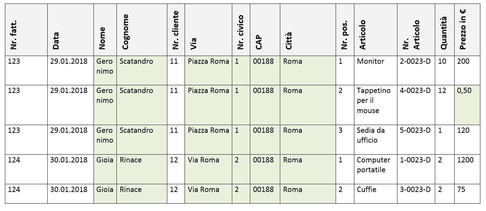
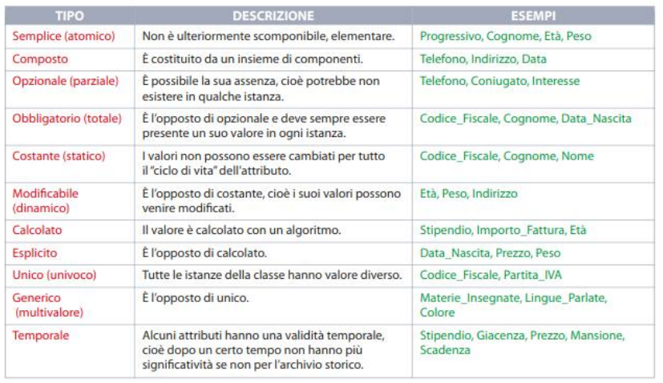
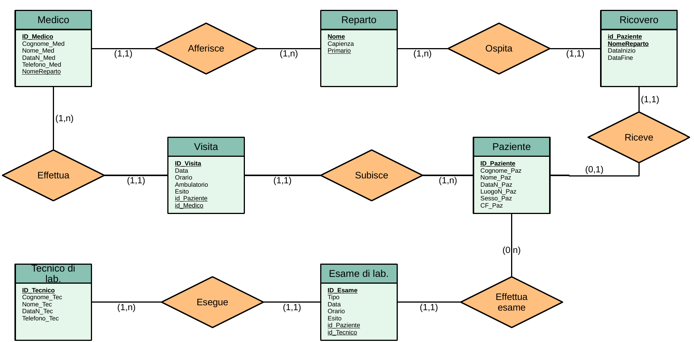
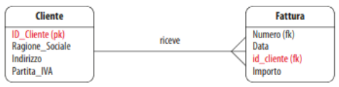
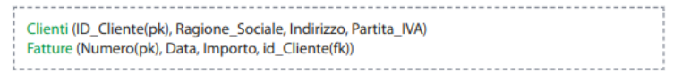

# Lezione 9 - Database

### Contenuti

1. [Introduzione](#introduzione)
    - [Basi di dati](#basi-di-dati)
    - [Modello relazionale](#modello-entità-relazione)
1. [Entità](#entità)
    - [Modello Entità-Relazione](#modello-entità-relazione)
    - [Istanze](#istanze)
    - [Attributi](#attributi)
    - [Attributi chiave](#attributi-chiave)
    - [Chiavi artificiali](#chiavi-artificiali)
    - [Chiavi esterne](#chiavi-esterne)
    - [Esempio di diagramma E-R (schema concettuale)](#esempio-di-diagramma-e-r-schema-concettuale)
1. [Schema logico](#schema-logico)
    - [Realizzazione dello schema logico](#realizzazione-dello-schema-logico)
    - [Schema logico del database ospedaliero](#schema-logico-del-database-ospedaliero)

# Introduzione

## Basi di dati
Nelle applicazioni informatiche sono presenti informazioni che è necessario memorizzare in modo permanente per renderle utilizzabili per elaborazioni. Inoltre, quando molti utenti lavorano su un insieme di dati, è necessario avere una sola copia dei dati, sempre aggiornata, che consenta l'accesso simultaneo a più utenti. Questo compito è svolto dai **database** (basi di dati). 

Le basi di dati sono raccolte di dati progettati in modo tale da poter essere utilizzati in maniera ottimizzata da diverse applicazioni e diversi utenti.

Il sistema che gestisce i dati e la loro organizzazione è detto **DBMS** (DataBase Management System).

Un DBMS deve:
- gestire grandi quantità di dati, senza essere un "collo di bottiglia";
- garantire la condivisione dei dati, ad esempio coordinando gli accessi;
- garantire la persistenza dei dati e la loro integrità, controllando gli accessi;
- avere un'interfaccia grafica per l'amministrazione dei dati.

## Modello relazionale
Il modello maggiormente utilizzato per rappresentare i dati è il modello relazionale, introdotto da E.Codd nel 1970, che si realizza mediante **tabelle**.

Le colonne delle tabelle rappresentano **campi** o proprietà, le righe rappresentano i diversi **record**.

    

# Entità

## Modello Entità-Relazione
Il modello E-R permette di modellare graficamente il mondo reale sotto forma di **entità** e **relazioni** tra esse.

Le entità sono gli oggetti principali su cui vengono raccolte le informazioni. Ogni entità rappresenta graficamente un oggetto, concreto o astratto, del mondo reale.

Ogni entità avrà un nome, che permette di identificare ogni **istanza** (ogni "esemplare") di quella classe.

Le relazioni tra entità verranno rappresentate mediante linee che collegano le entità.

## Istanze
Ogni istanza di una certa entità è caratterizzato da un **insieme di valori che descrivono le sue proprietà**.

Tutte le istanze di una certa entità hanno gli stessi attributi, ma con valori diversi per poterle distinguere.

Ad esempio, per l'entità "Studente", gli attributi possono essere "Nome", "Cognome", "Codice fiscale", "Data di nascita", "Sezione", ecc.

## Attributi

I tipi di attributi sono mostrati in figura.

    

Ad esempio, per l'entità "Persona":
- **Nome** stringa(20), obbligatorio, non NULL
- **Cognome** stringa(20), obbligatorio, non NULL
- **CodFiscale** stringa(16)
- **TitoloStudio** stringa(50)
- **DataNascita** giorno - mese - anno
- **Peso** numerico
- **AnniServizio** numerico

## Attributi chiave
Attributo fondamentale di ogni istanza è il suo identificatore univoco, detto **chiave primaria**.

Gli attributi chiave sono degli **identificatori univoci (ID)** di un'istanza di un'entità.

Ogni attributo chiave (*primary key*):
- deve essere obbligatorio, unico, esplicito (vedi tabella precedente);
- non deve essere modificabile;
- non può avere valore NULL.

Nell'esempio precedente, la chiave primaria potrebbe essere il codice fiscale.

## Chiavi artificiali
Una chiave artificiale è un attributo che assegna un **codice univoco** ad ogni istanza.

Esempio: la numerazione sequenziale delle tessere rilasciate da una associazione.

La maggior parte dei DBMS ammette il tipo contatore: gli attributi definiti come contatore si **autoincrementano di 1 per ogni record che viene aggiunto**.

Alle chiavi artificiali viene solitamente dato un nome che inizia con `ID_` (`ID_Studente`, `ID_Auto`).

## Chiavi esterne
Le chiavi esterne (*foreign keys*) sono utilizzate per **realizzare i collegamenti** tra entità, risolvendo quindi i collegamenti uno-a-molti.

Se le chiavi esterne sono chiavi artificiali, vengono nominate in modo simile a quanto si fa per le chiavi primarie, con il prefisso `id_`(minuscolo).

## Esempio di diagramma E-R (schema concettuale)

    

# Schema logico

## Realizzazione dello schema logico
Il modello (o schema) logico viene utilizzato come input per la progettazione vera e propria del database: deve avere quindi il massimo livello di dettaglio e precisione possibile.

Deve contenere tutte le informazioni necessarie per definire le tabelle, riportando la descrizione puntuale e completa del significato di ogni dato memorizzato.

> Lo schema logico trasforma le informazioni del modello concettuale in un formato efficiente.

Ad esempio, se nello schema concettuale abbiamo:

    

nello schema logico otteniamo:

    

## Schema logico del database ospedaliero
- **Medico:** ID_Medico (pk), Cognome_Med, Nome_Med, DataN_Med, Telefono_Med, NomeReparto (fk);
- **Paziente:** ID_Paziente (pk), Cognome_Paz, Nome_Paz, DataN_Paz, LuogoN_Paz, Sesso_Paz, CF_Paz;
**Reparto:** Nome (pk), Capienza, Primario (fk);
- **Ricovero:** id_Paziente (pk), NomeReparto (pk), DataInizio, DataFine;
- **Visita:** ID_Visita (pk), Data, Orario, Ambulatorio, Esito, id_Paziente (fk), id_Medico (fk);
- **EsameLab:** ID_Esame (pk), Tipo, Data, Orario, Esito, id_Paziente (fk), id_Tecnico (fk);
- **TecnicoLab:** ID_Tecnico (pk), Cognome_Tec, Nome_Tec, DataN_Tec, Telefono_Tec.