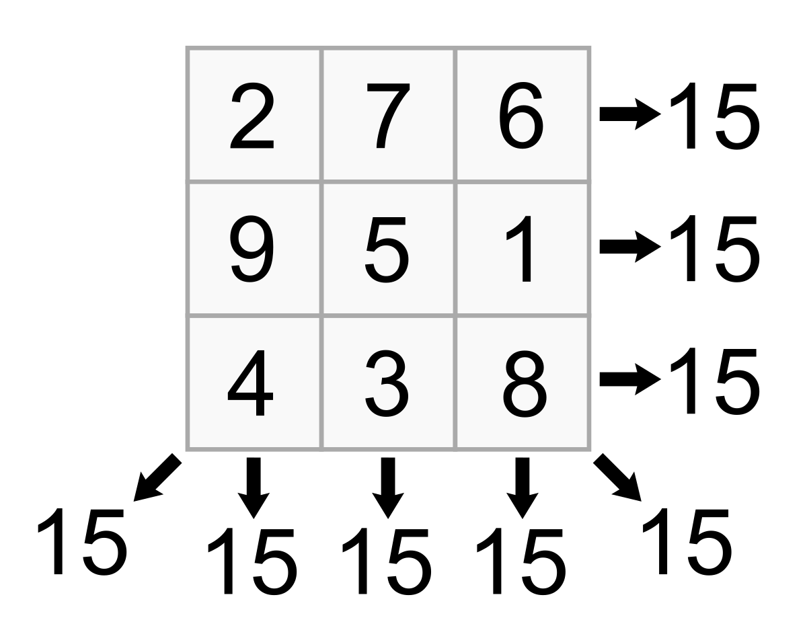
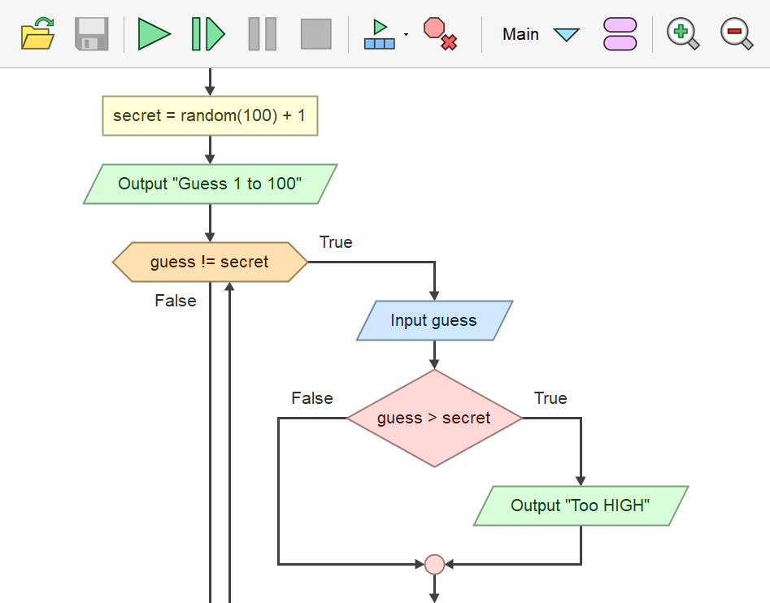
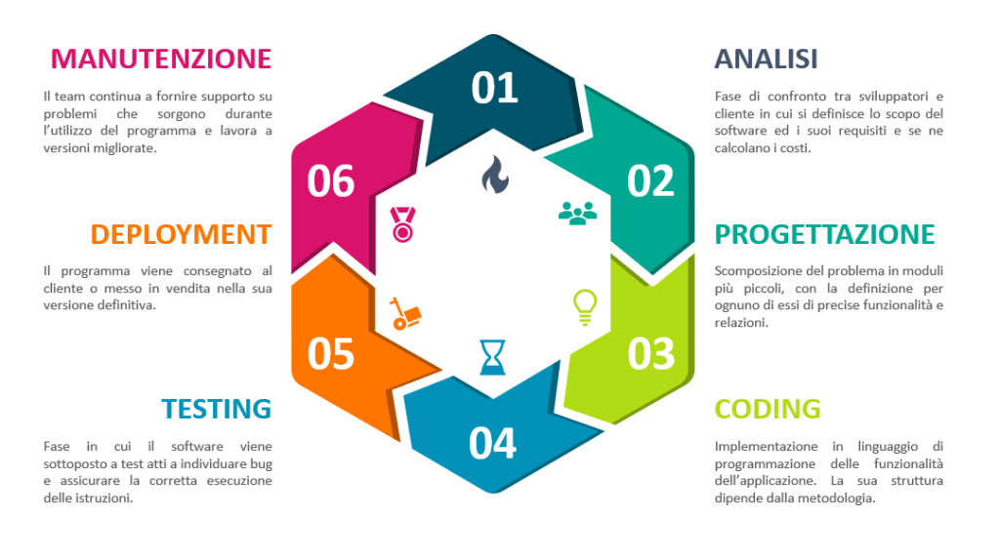

# Lezione 10 - Algoritmi

### Contenuti

1. [Introduzione](#introduzione)
    - [Definizione di algoritmo](#definizione-di-algoritmo)
    - [Sequenza di Fibonacci](#sequenza-di-fibonacci)
    - [Crivello di Eratostene](#crivello-di-eratostene)
    - [Il quadrato magico](#il-quadrato-magico)
    - [Costruzione di un algoritmo](#costruzione-di-un-algoritmo)
1. [Pseudocodifica](#pseudocodifica)
    - [Definizione](#definizione)
    - [Operatori](#operatori)
    - [Parole chiave](#parole-chiave)
        - [Esempi](#esempi)
1. [Diagrammi](#diagrammi)
    - [Diagrammi a blocchi (flowchart)](#diagrammi-a-blocchi-flowchart)
        - [Esempi](#esempi-1)
1. [Strutture](#struttura-condizionale))
    - [Sequenza](#sequenza)
    - [Struttura condizionale](#struttura-condizionale)
    - [Iterazione](#iterazione)
    - [Applicazioni per creare diagrammi di flusso](#applicazioni-per-creare-diagrammi-di-flusso)
1. [Linguaggi](#licenze-software)
    - [Dai codici ai linguaggi](#dai-codici-ai-linguaggi)
    - [Linguaggi di programmazione](#linguaggi-di-programmazione)
    - [Linguaggi di basso livello](#linguaggi-di-basso-livello)
    - [Linguaggi di alto livello](#linguaggi-di-alto-livello)
    - [Traduzione in linguaggio macchina](#traduzione-in-linguaggio-macchina)
    - [Compilatori e interpreti](#compilatori-e-interpreti)
1. [Algebra booleana](#algebra-booleana)
    - [Le operazioni logiche](#le-operazioni-logiche)
    - [NOT](#not)
    - [AND](#and)
    - [OR](#or)
1. [Programmi](#programmi)
    - [Cos'è un programma](#cosè-un-programma)
    - [Bug e debug](#bug-e-debug)
    - [Licenze software](#licenze-software)

# Introduzione
## Definizione di algoritmo
Il termine viene dall'algebrista persiano del IX secolo al-Khuwarizmi.

**Un algoritmo è la descrizione di un insieme finito di istruzioni che devono essere eseguite per portare a termine un dato compito.**

Esempi: istruzioni di montaggio di un mobile, ricetta di cucina, somme in colonna.

Ogni algoritmo prevede la presenza di un **esecutore**, che deve essere in grado di eseguire tutte le operazioni richieste.

## Sequenza di Fibonacci
La famosissima sequenza di Fibonacci è costituita da numeri che vengono ottenuti sommando i due numeri precedenti della sequenza stessa. I primi due numeri sono $ 1 $:
\[ 1 \qquad 1 \qquad 2 \qquad 3 \qquad 5 \qquad 8 \qquad 13 \qquad 21 \qquad \ldots\]

Possiamo operare con il seguente algoritmo:

- inizia con 1 e 1;
- per ottenere l'$n$-esimo numero $ F_n $ della sequenza, calcola $ F_{n-1} + F_{n-2} $.

## Crivello di Eratostene
Il crivello (cioè "setaccio") di Eratostene è un antico algoritmo per la ricerca dei numeri primi fino a un valore massimo prestabilito.

Procedimento:
- si scrivono tutti i numeri naturali a partire da $ 2 $ fino a $ n $ in un elenco;
- si cancellano tutti i multipli del primo numero escluso il numero stesso;
- si prende il primo numero non cancellato maggiore di $ 2 $ e si cancellano tutti i suoi multipli eccetto il numero stesso;
- si ripete l'operazione precedente fino a che il primo numero non cancellato maggiore di $ 2 $ non presenta multipli nell'elenco; i numeri che restano sono i numeri primi minori o uguali a $ n $.

[Animazione del crivello di Eratostene con n=120](https://upload.wikimedia.org/wikipedia/commons/b/b9/Sieve_of_Eratosthenes_animation.gif)

## Il quadrato magico
Un quadrato magico è un quadrato con $ n $ numeri per lato, in cui la somma delle cifre di qualsiasi riga, colonna o diagonale fornisce lo stesso risultato.

    

Per compilare un quadrato magico con lato dispari, possiamo usare il seguente algoritmo (esempio con $ n = 5 $).
- Scrivere 1 nella riga superiore, al centro
  $$ \begin{bmatrix}
    ? & ? & 1 & ? & ? \\
    ? & ? & ? & ? & ? \\
    ? & ? & ? & ? & ? \\
    ? & ? & ? & ? & ? \\
    ? & ? & ? & ? & ? 
  \end{bmatrix}  $$
- Spostarsi a destra di una colonna e in su di una riga (ripartire dal basso se si è nella riga più alta, e da sinistra se si è già all'estrema destra) e scrivere il numero intero successivo.
  $$ \begin{bmatrix}
    ? & ? & 1 & ? & ? \\
    ? & ? & ? & ? & ? \\
    ? & ? & ? & ? & ? \\
    ? & ? & ? & ? & ? \\
    ? & ? & ? & 2 & ? 
  \end{bmatrix}  $$
- Ripetere l'operazione precedente. Se la casella di destinazione è già occupata, scrivere il nuovo numero nella posizione immediatamente sotto a quella di partenza.
$$ \begin{bmatrix}
  ? & ? & 1 & ? & ? \\
  ? & ? & ? & ? & ? \\
  ? & ? & ? & ? & ? \\
  ? & ? & ? & ? & 3 \\
  ? & ? & ? & 2 & ? 
\end{bmatrix}  $$
$$ \begin{bmatrix}
  ? & ? & 1 & ? & ? \\
  ? & 5 & ? & ? & ? \\
  4 & 6 & ? & ? & ? \\
  ? & ? & ? & ? & 3 \\
  ? & ? & ? & 2 & ? 
\end{bmatrix}  $$
$$ \begin{bmatrix}
  ? & ? & 1 & 8 & ? \\
  ? & 5 & 7 & ? & ? \\
  4 & 6 & ? & ? & ? \\
  10 & ? & ? & ? & 3 \\
  11 & ? & ? & 2 & 9 
\end{bmatrix}  $$
$$ \begin{bmatrix}
  17 & 24 & 1 & 8 & 15 \\
  23 & 5 & 7 & 14 & 16 \\
  4 & 6 & 13 & 20 & 22 \\
  10 & 12 & 19 & 21 & 3 \\
  11 & 18 & 25 & 2 & 9 
\end{bmatrix}  $$

## Costruzione di un algoritmo

Il **modello del problema** è una rappresentazione schematica di un particolare aspetto della realtà.

Vengono individuate:
- le entità, oggetti importanti ai fini della descrizione;
- le proprietà delle entità;
- le variabili;
- le costanti.

Distinguiamo:
- **dati**, valori assunti dalle variabili o dalle costanti;
- **azioni**, attività sui dati che permettono di ottenere il risultato.

I dati possono essere numerici, alfabetici o stringhe generiche. Le azioni possono essere di tipo aritmetico o logico.

Per risolvere un problema seguiamo in linea di massima questo procedimento:
- Descrizione del problema:
    - individuazione dei dati di input;
    - individuazione dei dati di output;
    - individuazione delle risorse a disposizione.
- Stesura dell'algoritmo:
    - scrittura con diagrammi;
    - implementazione;
    - controllo e debug.
  

# Pseudocodifica
## Definizione
È la descrizione di un algoritmo utilizzando il linguaggio comune secondo una serie di **regole rigorose** e un **vocabolario ristretto**.

Caratteristiche:
- Un algoritmo viene aperto e chiuso dalle parole `inizio` e `fine`.
- Operazioni di *input*: `immetti`, `leggi`, `acquisisci`, `read`.
- Operazioni di *output*: `scrivi`, `mostra`, `comunica`, `write`.

## Operatori
Nel linguaggio di pseudocodifica possiamo utilizzare diversi operatori:
- assegnazione di un valore ad una variabile: `assegna x = 9` o `calcola y = x + 3`;
- operatori matematici;
- operatori di confronto;
- operatori logici (`AND`, `OR`, `NOT`, `XOR`).

## Parole chiave
In pseudocodifica si usano alcune parole speciali che permettono di **strutturare logicamente l'algoritmo**.
- `se`;
- `allora`;
- `altrimenti`;
- `fine se`;
- `esegui`;
- `finché`;
- `mentre`;
- `ripeti`.

### Esempi
Algoritmo in pseudocodifica per il calcolo dell'area di un triangolo:

    inizio
    immetti base
    immetti altezza
    calcola area = .5 * base * altezza
    scrivi area
    fine

Algoritmo in pseudocodifica per salutare in base all'ora del giorno:

    inizio
    acquisisci ora;
    se ora < 12:00:
        scrivi `Buongiorno';
    se ora < 18:00:
        scrivi `Buon pomeriggio';
    altrimenti:
        scrivi `Buonasera';
    fine se;
    fine

# Diagrammi
## Diagrammi a blocchi (flowchart)
I diagrammi a blocchi permettono di **rappresentare graficamente l'algoritmo**.

In questi schemi, blocchi di forme diverse hanno significati diversi.

<pre class="mermaid">
graph TD
A([Inizio, Fine]) 
C([Fine])
D[Elaborazione, calcolo] 
E[/Input, output/]
F{Decisione}
</pre>

### Esempi
Calcolo dell'area di un triangolo:
<pre class="mermaid">
graph LR
A([Inizio]) --> B[/input: base/] --> C[/input: altezza/] --> D[area = 0.5 * base * altezza] --> E[/output: area/] --> F([Fine])
</pre>

Saluto in base all'ora del giorno:
<pre class="mermaid">
graph LR
A([Inizio]) --> B[/input: ora/] --> C{ora < 12?} --sì--> D[/output: 'Buongiorno'/] -->Z([Fine])
C --no--> E{ora < 18?} --sì--> F[/output: 'Buon pomeriggio'/] --> Z
E --no--> G[/output: 'Buonasera'/] --> Z
</pre>

# Strutture
Le istruzioni di un algoritmo possono:

- essere organizzate **in sequenza**;
- presentare delle **alternative** (struttura condizionale);
- essere **ripetute** un certo numero di volte o finché si verifica una certa condizione (struttura iterativa).

Ogni algoritmo può essere scritto con una combinazione di queste tre strutture fondamentali.

## Sequenza
<pre class="mermaid">
graph LR
A([Inizio]) --> B[/.../] --> D[...] --> E[/.../] --> C[...] --> F([Fine])
</pre>

## Struttura condizionale
<pre class="mermaid">
graph LR
A([Inizio]) --> C{condizione?} --sì--> D[operazione 1] -->Z([Fine])
C --no--> E[operazione 2] --> Z
</pre>

## Iterazione
<pre class="mermaid">
graph LR
A([Inizio]) --> B[operazione 1] --> C{condizione?} --sì--> D[operazione 2] -->Z([Fine])
C --no--> B
</pre>

## Applicazioni per creare diagrammi di flusso
[Flowgorithm](http://www.flowgorithm.org/index.html) è un programma gratuito, disponibile per Windows, per la creazione di diagrammi di flusso.

    

Uno strumento simile ma completamente online è [flow.io](https://app.diagrams.net/).

# Linguaggi
## Dai codici ai linguaggi

La scrittura binaria è molto comoda e semplice da gestire per una macchina (0 = circuito chiuso, 1 = circuito aperto).

Un programma (ovvero un insieme di algoritmi) per poter essere eseguito da una macchina deve essere scritto in **linguaggio binario**.

Intuiamo tuttavia che scrivere un programma in codice binario è molto complesso per un essere umano, ed è per questo motivo che sono stati inventati i **linguaggi di programmazione**.

I linguaggi di programmazione permettono di scrivere algoritmi con un linguaggio più "vicino" a quello che parliamo.

## Linguaggi di programmazione
I linguaggi di programmazione sono particolari **linguaggi artificiali** che vengono utilizzati nella comunicazione umano-computer.

Le caratteristiche di un linguaggio di programmazione sono:
- un vocabolario ristretto (si utilizzano poche parole semplici);
- regole di costruzione delle istruzioni molto semplici e rigide;
- l'utilizzo di strutture predeterminate (come quelle viste).

Esempi di linguaggi di programmazione tra i circa 2500 esistenti: Fortran (1957), Pascal (1970), C++ (1986), Python (1991), JavaScript (1995, usato nel 98% dei siti web).

## Linguaggi di basso livello
Il **linguaggio macchina** è quello direttamente compreso e utilizzato dalla CPU ed è formato solo da 0 e 1.

Un linguaggio di **basso livello** è più semplice da comprendere del linguaggio macchina, ma è comunque molto lontano dai linguaggi che usiamo oggi per programmare, perché è difficile da comprendere per un umano.

Un esempio di linguaggio di basso livello è *assembly*, che usa istruzioni come:

    05 id ADD EAX, imm32

## Linguaggi di alto livello
I linguaggi di alto livello utilizzano un linguaggio pseudo-umano, che rende più facile la scrittura e la verifica del corretto funzionamento.

I linguaggi di programmazione di alto livello utilizzano come base la lingua inglese.

Esempio di istruzione in C++:

    int num1, num2, differenza;
    cout << "Due numeri: ";
    cin >> num1 >> num2;
    differenza = num1 - num2;
    cout << "Risultato = " << differenza << endl;

## Traduzione in linguaggio macchina
La macchina non può eseguire direttamente le istruzioni scritte in un linguaggio di alto livello.

È dunque necessario un "interprete" che traduca il **programma sorgente** (in linguaggio di alto livello) in istruzioni di macchina.

La traduzione contemporanea all'esecuzione del sorgente è spesso piuttosto lenta, e pertanto si utilizzano dei **compilatori**.

## Compilatori e interpreti
Il compilatore è un programma (scritto in linguaggio macchina) in grado di leggere le istruzioni del sorgente, verificarne la correttezza linguistica e sviluppare automaticamente le corrispondenti istruzioni in codice macchina.

Il codice ottenuto, che la macchina può eseguire direttamente, è detto **eseguibile** o **programma oggetto**.
  
Non tutti i linguaggi richiedono la compilazione: alcuni, come JavaScript, possono essere eseguiti con traduzione simultanea. Sono detti linguaggi interpretati.

# Algebra booleana
Per scrivere algoritmi è utile conoscere l'algebra di Boole, che prende il nome da un logico del XIX secolo.

L'algebra di Boole introduce dei **connettivi logici**, che hanno dati in ingresso e restituiscono dati in uscita.

I dati sono 0 (o falso) e 1 (o vero).

## Le operazioni logiche
Le operazioni logiche più comuni sono:

- `AND` (congiunzione), indicata anche con `&`, `&& ` oppure $\wedge$;
- `OR` (disgiunzione), indicata anche con `||` oppure $\vee $;
- `NOT` (negazione), indicata con un punto esclamativo davanti ad un operatore.

Ad esempio:

- `A & B` significa "A e B";
- `A || B` significa "A oppure B";
- `A != B` significa "A diverso da B".

## NOT
Corrisponde alla negazione e tramuta uno 0 in un 1 e viceversa. Questa è la sua **tavola di verità**:

| A   | NOT(A) |
|:---:|:------:|
| 1   | 0      |
| 0   | 1      |

È un operatore unario perché riceve in ingresso un solo numero (bit).

## AND
Corrisponde alla congiunzione e restituisce un 1 solo se entrambi i bit in ingresso valgono 1.

| A   | B   | A `AND` B |
|:---:|:---:|:---------:|
| 1   | 1   | 1         |
| 1   | 0   | 0         |
| 0   | 1   | 0         |
| 0   | 0   | 0         |

È un operatore binario perché riceve in ingresso due bit.

## OR
Corrisponde alla disgiunzione e restituisce un 1 se almeno uno dei due bit in ingresso vale 1.

| A   | B   | A `OR` B  |
|:---:|:---:|:---------:|
| 1   | 1   | 1         |
| 1   | 0   | 1         |
| 0   | 1   | 1         |
| 0   | 0   | 0         |

Anche questo è un operatore binario perché riceve in ingresso due bit.

# Programmi
## Cos'è un programma
Un programma è un insieme di istruzioni, codificate come **linee di codice** scritte in un certo linguaggio di programmazione.

La programmazione è la scrittura, da parte di un programmatore umano, di queste linee di codice.

L'insieme delle linee di codice costituisce il **codice sorgente** del programma. Il codice sorgente può essere proprietario (*closed source*) oppure libero (*open source*).

     Il ciclo di vita del software

## Bug e debug
Il debugging (o debug) è l'individuazione e correzione da parte del programmatore di uno o più errori (**bug**, in italiano "baco") rilevati nel software, direttamente in fase di programmazione oppure a seguito della fase di testing o dell'utilizzo finale del programma stesso.

I bug sono tipicamente dovuti ad errori nella scrittura del codice sorgente di un programma.

I bug possono essere corretti con una **nuova versione** del programma o attraverso una **patch**.

## Licenze software
I programmi possono essere distribuiti da chi li sviluppa secondo modalità legali diverse:

- **freeware**, cioè programmi gratuiti il cui codice sorgente è protetto da copyright;
- **shareware**, cioè programmi che offrono un periodo di prova gratuito, al termine del quale è necessario pagare una licenza; se il programma deve essere acquistato prima di essere provato di parla di EULA (*End User License Agreement*);
- **open source**, cioè programmi che possono essere liberamente eseguiti, copiati, distribuiti e modificati; il codice sorgente è reso pubblico e non esiste un "proprietario".

<link rel="stylesheet" href="https://cdn.jsdelivr.net/npm/katex@0.10.0-rc.1/dist/katex.min.css" integrity="sha384-D+9gmBxUQogRLqvARvNLmA9hS2x//eK1FhVb9PiU86gmcrBrJAQT8okdJ4LMp2uv" crossorigin="anonymous">

